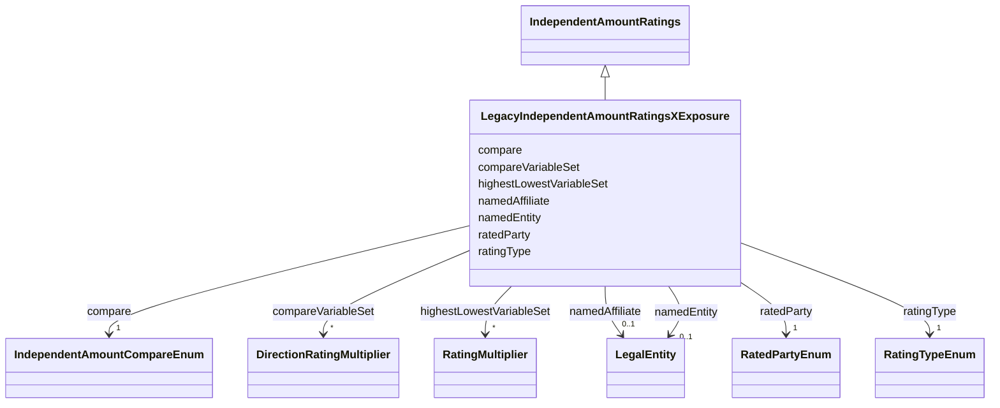

```mermaid
 classDiagram
    class LegacyIndependentAmountRatingsXExposure
    click LegacyIndependentAmountRatingsXExposure href "../LegacyIndependentAmountRatingsXExposure"
      IndependentAmountRatings <|-- LegacyIndependentAmountRatingsXExposure
        click IndependentAmountRatings href "../IndependentAmountRatings"
      
      LegacyIndependentAmountRatingsXExposure : compare
        
          
    
        
        
        LegacyIndependentAmountRatingsXExposure --> "1" IndependentAmountCompareEnum : compare
        click IndependentAmountCompareEnum href "../IndependentAmountCompareEnum"
    

        
      LegacyIndependentAmountRatingsXExposure : compareVariableSet
        
          
    
        
        
        LegacyIndependentAmountRatingsXExposure --> "*" DirectionRatingMultiplier : compareVariableSet
        click DirectionRatingMultiplier href "../DirectionRatingMultiplier"
    

        
      LegacyIndependentAmountRatingsXExposure : highestLowestVariableSet
        
          
    
        
        
        LegacyIndependentAmountRatingsXExposure --> "*" RatingMultiplier : highestLowestVariableSet
        click RatingMultiplier href "../RatingMultiplier"
    

        
      LegacyIndependentAmountRatingsXExposure : namedAffiliate
        
          
    
        
        
        LegacyIndependentAmountRatingsXExposure --> "0..1" LegalEntity : namedAffiliate
        click LegalEntity href "../LegalEntity"
    

        
      LegacyIndependentAmountRatingsXExposure : namedEntity
        
          
    
        
        
        LegacyIndependentAmountRatingsXExposure --> "0..1" LegalEntity : namedEntity
        click LegalEntity href "../LegalEntity"
    

        
      LegacyIndependentAmountRatingsXExposure : ratedParty
        
          
    
        
        
        LegacyIndependentAmountRatingsXExposure --> "1" RatedPartyEnum : ratedParty
        click RatedPartyEnum href "../RatedPartyEnum"
    

        
      LegacyIndependentAmountRatingsXExposure : ratingType
        
          
    
        
        
        LegacyIndependentAmountRatingsXExposure --> "1" RatingTypeEnum : ratingType
        click RatingTypeEnum href "../RatingTypeEnum"
    

        
      
```
