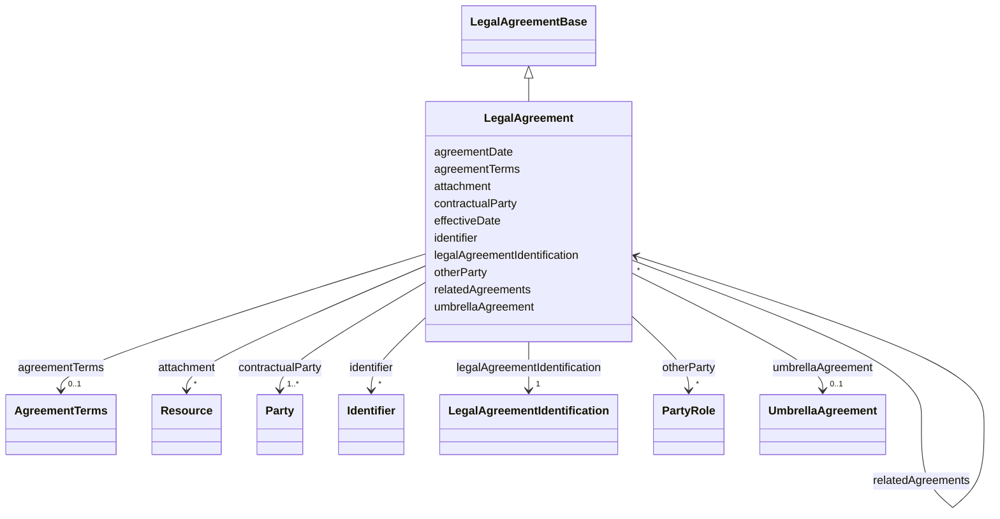

```mermaid
 classDiagram
    class LegalAgreement
    click LegalAgreement href "../LegalAgreement"
      LegalAgreementBase <|-- LegalAgreement
        click LegalAgreementBase href "../LegalAgreementBase"
      
      LegalAgreement : agreementDate
        
      LegalAgreement : agreementTerms
        
          
    
        
        
        LegalAgreement --> "0..1" AgreementTerms : agreementTerms
        click AgreementTerms href "../AgreementTerms"
    

        
      LegalAgreement : attachment
        
          
    
        
        
        LegalAgreement --> "*" Resource : attachment
        click Resource href "../Resource"
    

        
      LegalAgreement : contractualParty
        
          
    
        
        
        LegalAgreement --> "1..*" Party : contractualParty
        click Party href "../Party"
    

        
      LegalAgreement : effectiveDate
        
      LegalAgreement : identifier
        
          
    
        
        
        LegalAgreement --> "*" Identifier : identifier
        click Identifier href "../Identifier"
    

        
      LegalAgreement : legalAgreementIdentification
        
          
    
        
        
        LegalAgreement --> "1" LegalAgreementIdentification : legalAgreementIdentification
        click LegalAgreementIdentification href "../LegalAgreementIdentification"
    

        
      LegalAgreement : otherParty
        
          
    
        
        
        LegalAgreement --> "*" PartyRole : otherParty
        click PartyRole href "../PartyRole"
    

        
      LegalAgreement : relatedAgreements
        
          
    
        
        
        LegalAgreement --> "*" LegalAgreement : relatedAgreements
        click LegalAgreement href "../LegalAgreement"
    

        
      LegalAgreement : umbrellaAgreement
        
          
    
        
        
        LegalAgreement --> "0..1" UmbrellaAgreement : umbrellaAgreement
        click UmbrellaAgreement href "../UmbrellaAgreement"
    

        
      
```
