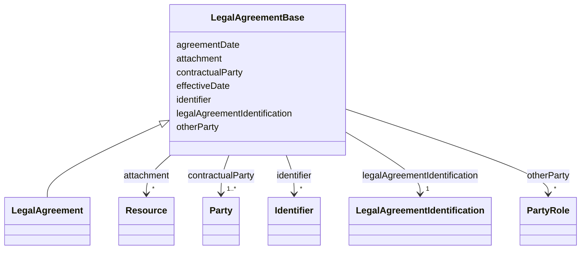

```mermaid
 classDiagram
    class LegalAgreementBase
    click LegalAgreementBase href "../LegalAgreementBase"
      LegalAgreementBase <|-- LegalAgreement
        click LegalAgreement href "../LegalAgreement"
      
      LegalAgreementBase : agreementDate
        
      LegalAgreementBase : attachment
        
          
    
        
        
        LegalAgreementBase --> "*" Resource : attachment
        click Resource href "../Resource"
    

        
      LegalAgreementBase : contractualParty
        
          
    
        
        
        LegalAgreementBase --> "1..*" Party : contractualParty
        click Party href "../Party"
    

        
      LegalAgreementBase : effectiveDate
        
      LegalAgreementBase : identifier
        
          
    
        
        
        LegalAgreementBase --> "*" Identifier : identifier
        click Identifier href "../Identifier"
    

        
      LegalAgreementBase : legalAgreementIdentification
        
          
    
        
        
        LegalAgreementBase --> "1" LegalAgreementIdentification : legalAgreementIdentification
        click LegalAgreementIdentification href "../LegalAgreementIdentification"
    

        
      LegalAgreementBase : otherParty
        
          
    
        
        
        LegalAgreementBase --> "*" PartyRole : otherParty
        click PartyRole href "../PartyRole"
    

        
      
```
