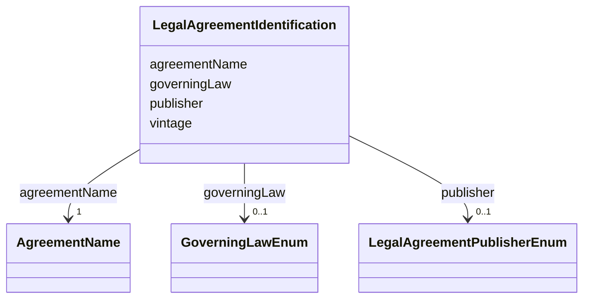

```mermaid
 classDiagram
    class LegalAgreementIdentification
    click LegalAgreementIdentification href "../LegalAgreementIdentification"
      LegalAgreementIdentification : agreementName
        
          
    
        
        
        LegalAgreementIdentification --> "1" AgreementName : agreementName
        click AgreementName href "../AgreementName"
    

        
      LegalAgreementIdentification : governingLaw
        
          
    
        
        
        LegalAgreementIdentification --> "0..1" GoverningLawEnum : governingLaw
        click GoverningLawEnum href "../GoverningLawEnum"
    

        
      LegalAgreementIdentification : publisher
        
          
    
        
        
        LegalAgreementIdentification --> "0..1" LegalAgreementPublisherEnum : publisher
        click LegalAgreementPublisherEnum href "../LegalAgreementPublisherEnum"
    

        
      LegalAgreementIdentification : vintage
        
      
```
