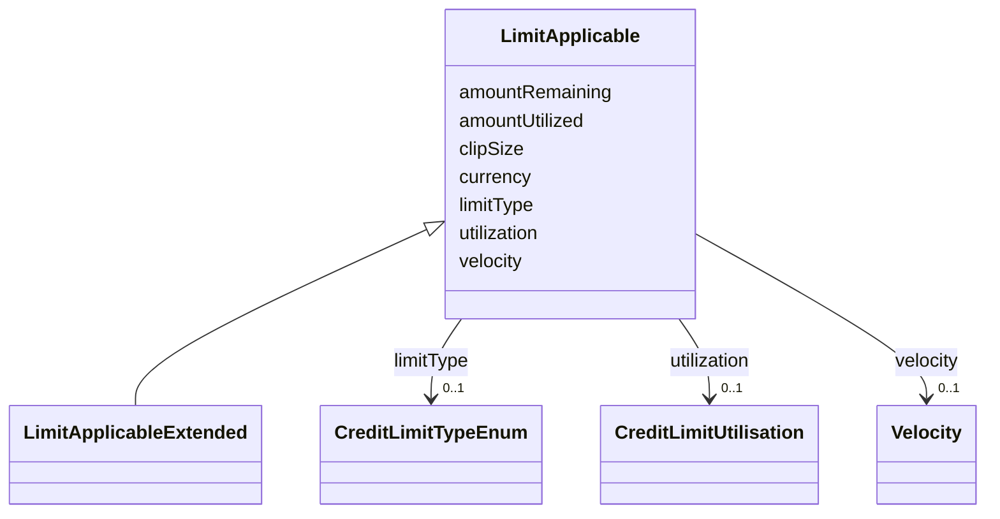

```mermaid
 classDiagram
    class LimitApplicable
    click LimitApplicable href "../LimitApplicable"
      LimitApplicable <|-- LimitApplicableExtended
        click LimitApplicableExtended href "../LimitApplicableExtended"
      
      LimitApplicable : amountRemaining
        
      LimitApplicable : amountUtilized
        
      LimitApplicable : clipSize
        
      LimitApplicable : currency
        
      LimitApplicable : limitType
        
          
    
        
        
        LimitApplicable --> "0..1" CreditLimitTypeEnum : limitType
        click CreditLimitTypeEnum href "../CreditLimitTypeEnum"
    

        
      LimitApplicable : utilization
        
          
    
        
        
        LimitApplicable --> "0..1" CreditLimitUtilisation : utilization
        click CreditLimitUtilisation href "../CreditLimitUtilisation"
    

        
      LimitApplicable : velocity
        
          
    
        
        
        LimitApplicable --> "0..1" Velocity : velocity
        click Velocity href "../Velocity"
    

        
      
```
