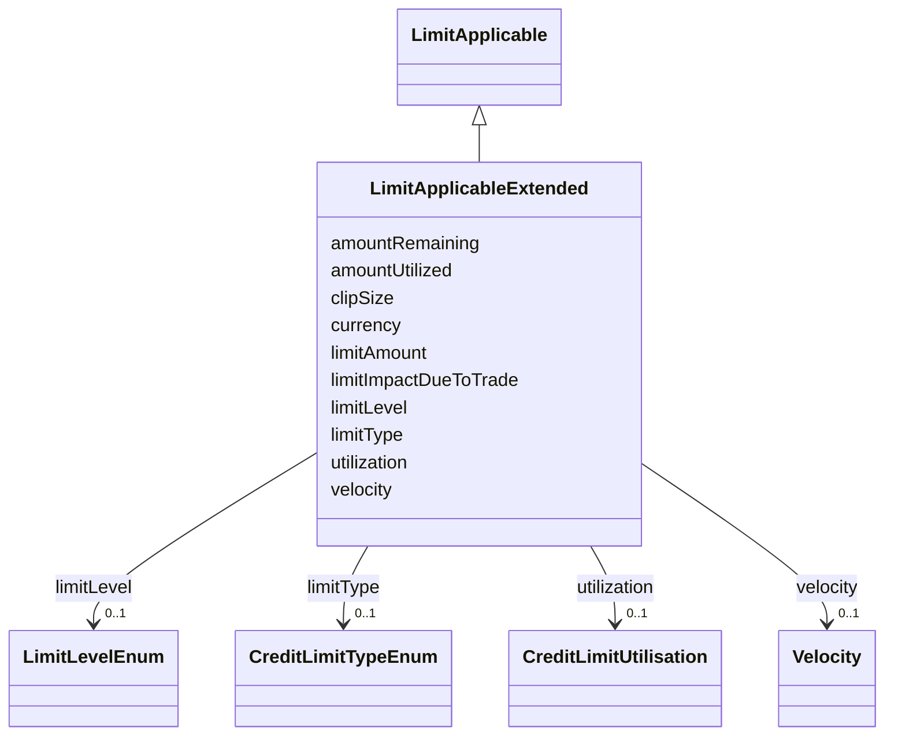

```mermaid
 classDiagram
    class LimitApplicableExtended
    click LimitApplicableExtended href "../LimitApplicableExtended"
      LimitApplicable <|-- LimitApplicableExtended
        click LimitApplicable href "../LimitApplicable"
      
      LimitApplicableExtended : amountRemaining
        
      LimitApplicableExtended : amountUtilized
        
      LimitApplicableExtended : clipSize
        
      LimitApplicableExtended : currency
        
      LimitApplicableExtended : limitAmount
        
      LimitApplicableExtended : limitImpactDueToTrade
        
      LimitApplicableExtended : limitLevel
        
          
    
        
        
        LimitApplicableExtended --> "0..1" LimitLevelEnum : limitLevel
        click LimitLevelEnum href "../LimitLevelEnum"
    

        
      LimitApplicableExtended : limitType
        
          
    
        
        
        LimitApplicableExtended --> "0..1" CreditLimitTypeEnum : limitType
        click CreditLimitTypeEnum href "../CreditLimitTypeEnum"
    

        
      LimitApplicableExtended : utilization
        
          
    
        
        
        LimitApplicableExtended --> "0..1" CreditLimitUtilisation : utilization
        click CreditLimitUtilisation href "../CreditLimitUtilisation"
    

        
      LimitApplicableExtended : velocity
        
          
    
        
        
        LimitApplicableExtended --> "0..1" Velocity : velocity
        click Velocity href "../Velocity"
    

        
      
```
