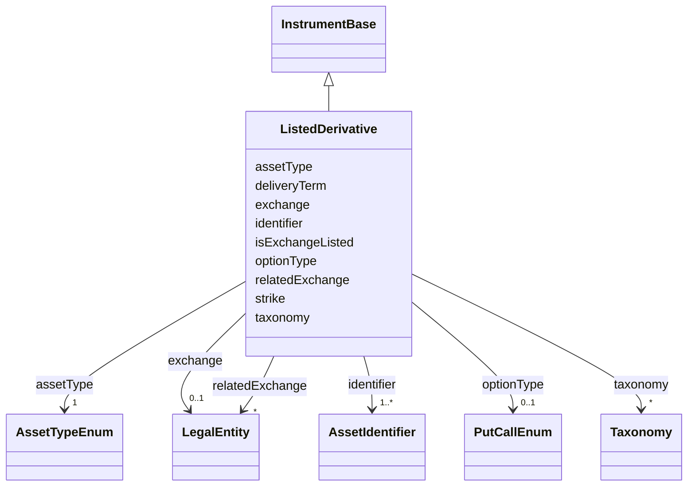

```mermaid
 classDiagram
    class ListedDerivative
    click ListedDerivative href "../ListedDerivative"
      InstrumentBase <|-- ListedDerivative
        click InstrumentBase href "../InstrumentBase"
      
      ListedDerivative : assetType
        
          
    
        
        
        ListedDerivative --> "1" AssetTypeEnum : assetType
        click AssetTypeEnum href "../AssetTypeEnum"
    

        
      ListedDerivative : deliveryTerm
        
      ListedDerivative : exchange
        
          
    
        
        
        ListedDerivative --> "0..1" LegalEntity : exchange
        click LegalEntity href "../LegalEntity"
    

        
      ListedDerivative : identifier
        
          
    
        
        
        ListedDerivative --> "1..*" AssetIdentifier : identifier
        click AssetIdentifier href "../AssetIdentifier"
    

        
      ListedDerivative : isExchangeListed
        
      ListedDerivative : optionType
        
          
    
        
        
        ListedDerivative --> "0..1" PutCallEnum : optionType
        click PutCallEnum href "../PutCallEnum"
    

        
      ListedDerivative : relatedExchange
        
          
    
        
        
        ListedDerivative --> "*" LegalEntity : relatedExchange
        click LegalEntity href "../LegalEntity"
    

        
      ListedDerivative : strike
        
      ListedDerivative : taxonomy
        
          
    
        
        
        ListedDerivative --> "*" Taxonomy : taxonomy
        click Taxonomy href "../Taxonomy"
    

        
      
```
