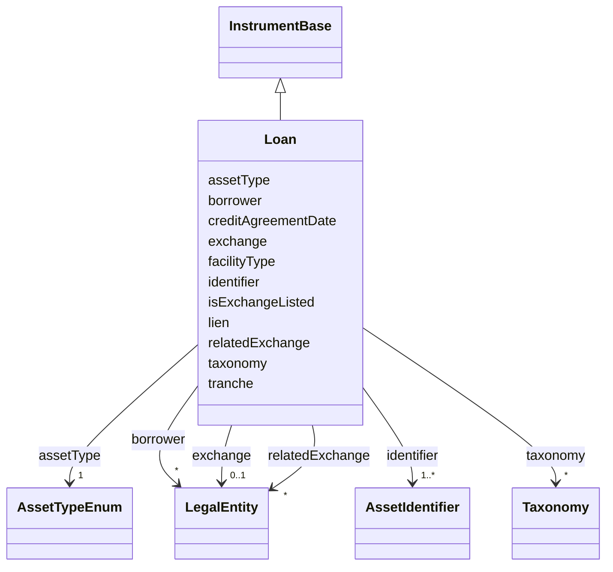

```mermaid
 classDiagram
    class Loan
    click Loan href "../Loan"
      InstrumentBase <|-- Loan
        click InstrumentBase href "../InstrumentBase"
      
      Loan : assetType
        
          
    
        
        
        Loan --> "1" AssetTypeEnum : assetType
        click AssetTypeEnum href "../AssetTypeEnum"
    

        
      Loan : borrower
        
          
    
        
        
        Loan --> "*" LegalEntity : borrower
        click LegalEntity href "../LegalEntity"
    

        
      Loan : creditAgreementDate
        
      Loan : exchange
        
          
    
        
        
        Loan --> "0..1" LegalEntity : exchange
        click LegalEntity href "../LegalEntity"
    

        
      Loan : facilityType
        
      Loan : identifier
        
          
    
        
        
        Loan --> "1..*" AssetIdentifier : identifier
        click AssetIdentifier href "../AssetIdentifier"
    

        
      Loan : isExchangeListed
        
      Loan : lien
        
      Loan : relatedExchange
        
          
    
        
        
        Loan --> "*" LegalEntity : relatedExchange
        click LegalEntity href "../LegalEntity"
    

        
      Loan : taxonomy
        
          
    
        
        
        Loan --> "*" Taxonomy : taxonomy
        click Taxonomy href "../Taxonomy"
    

        
      Loan : tranche
        
      
```
