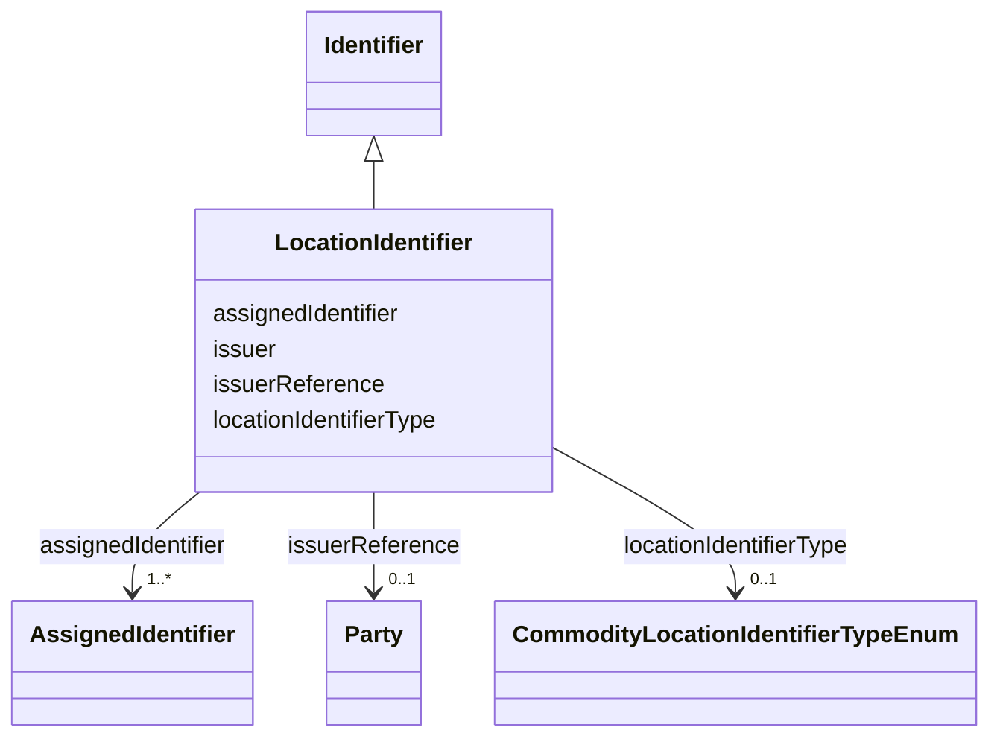

```mermaid
 classDiagram
    class LocationIdentifier
    click LocationIdentifier href "../LocationIdentifier"
      Identifier <|-- LocationIdentifier
        click Identifier href "../Identifier"
      
      LocationIdentifier : assignedIdentifier
        
          
    
        
        
        LocationIdentifier --> "1..*" AssignedIdentifier : assignedIdentifier
        click AssignedIdentifier href "../AssignedIdentifier"
    

        
      LocationIdentifier : issuer
        
      LocationIdentifier : issuerReference
        
          
    
        
        
        LocationIdentifier --> "0..1" Party : issuerReference
        click Party href "../Party"
    

        
      LocationIdentifier : locationIdentifierType
        
          
    
        
        
        LocationIdentifier --> "0..1" CommodityLocationIdentifierTypeEnum : locationIdentifierType
        click CommodityLocationIdentifierTypeEnum href "../CommodityLocationIdentifierTypeEnum"
    

        
      
```
