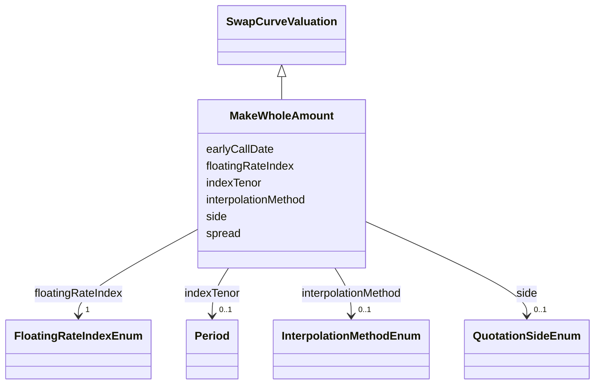

```mermaid
 classDiagram
    class MakeWholeAmount
    click MakeWholeAmount href "../MakeWholeAmount"
      SwapCurveValuation <|-- MakeWholeAmount
        click SwapCurveValuation href "../SwapCurveValuation"
      
      MakeWholeAmount : earlyCallDate
        
      MakeWholeAmount : floatingRateIndex
        
          
    
        
        
        MakeWholeAmount --> "1" FloatingRateIndexEnum : floatingRateIndex
        click FloatingRateIndexEnum href "../FloatingRateIndexEnum"
    

        
      MakeWholeAmount : indexTenor
        
          
    
        
        
        MakeWholeAmount --> "0..1" Period : indexTenor
        click Period href "../Period"
    

        
      MakeWholeAmount : interpolationMethod
        
          
    
        
        
        MakeWholeAmount --> "0..1" InterpolationMethodEnum : interpolationMethod
        click InterpolationMethodEnum href "../InterpolationMethodEnum"
    

        
      MakeWholeAmount : side
        
          
    
        
        
        MakeWholeAmount --> "0..1" QuotationSideEnum : side
        click QuotationSideEnum href "../QuotationSideEnum"
    

        
      MakeWholeAmount : spread
        
      
```
