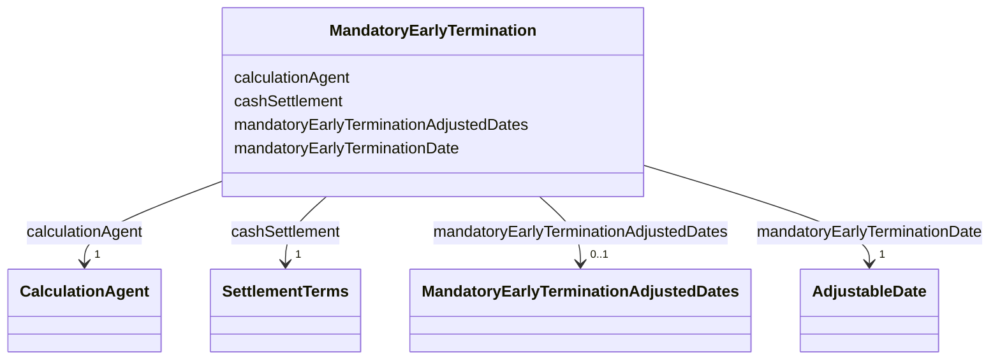

```mermaid
 classDiagram
    class MandatoryEarlyTermination
    click MandatoryEarlyTermination href "../MandatoryEarlyTermination"
      MandatoryEarlyTermination : calculationAgent
        
          
    
        
        
        MandatoryEarlyTermination --> "1" CalculationAgent : calculationAgent
        click CalculationAgent href "../CalculationAgent"
    

        
      MandatoryEarlyTermination : cashSettlement
        
          
    
        
        
        MandatoryEarlyTermination --> "1" SettlementTerms : cashSettlement
        click SettlementTerms href "../SettlementTerms"
    

        
      MandatoryEarlyTermination : mandatoryEarlyTerminationAdjustedDates
        
          
    
        
        
        MandatoryEarlyTermination --> "0..1" MandatoryEarlyTerminationAdjustedDates : mandatoryEarlyTerminationAdjustedDates
        click MandatoryEarlyTerminationAdjustedDates href "../MandatoryEarlyTerminationAdjustedDates"
    

        
      MandatoryEarlyTermination : mandatoryEarlyTerminationDate
        
          
    
        
        
        MandatoryEarlyTermination --> "1" AdjustableDate : mandatoryEarlyTerminationDate
        click AdjustableDate href "../AdjustableDate"
    

        
      
```
