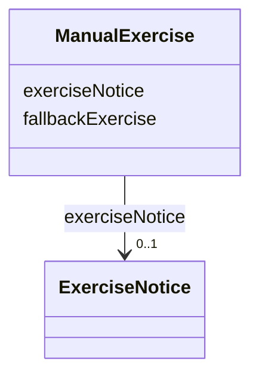

```mermaid
 classDiagram
    class ManualExercise
    click ManualExercise href "../ManualExercise"
      ManualExercise : exerciseNotice
        
          
    
        
        
        ManualExercise --> "0..1" ExerciseNotice : exerciseNotice
        click ExerciseNotice href "../ExerciseNotice"
    

        
      ManualExercise : fallbackExercise
        
      
```
