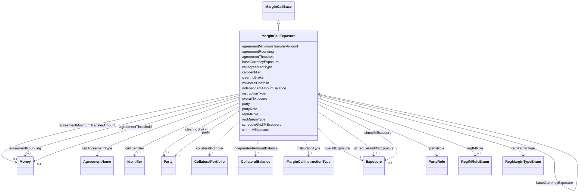

```mermaid
 classDiagram
    class MarginCallExposure
    click MarginCallExposure href "../MarginCallExposure"
      MarginCallBase <|-- MarginCallExposure
        click MarginCallBase href "../MarginCallBase"
      
      MarginCallExposure : agreementMinimumTransferAmount
        
          
    
        
        
        MarginCallExposure --> "0..1" Money : agreementMinimumTransferAmount
        click Money href "../Money"
    

        
      MarginCallExposure : agreementRounding
        
          
    
        
        
        MarginCallExposure --> "0..1" Money : agreementRounding
        click Money href "../Money"
    

        
      MarginCallExposure : agreementThreshold
        
          
    
        
        
        MarginCallExposure --> "0..1" Money : agreementThreshold
        click Money href "../Money"
    

        
      MarginCallExposure : baseCurrencyExposure
        
          
    
        
        
        MarginCallExposure --> "0..1" MarginCallExposure : baseCurrencyExposure
        click MarginCallExposure href "../MarginCallExposure"
    

        
      MarginCallExposure : callAgreementType
        
          
    
        
        
        MarginCallExposure --> "1" AgreementName : callAgreementType
        click AgreementName href "../AgreementName"
    

        
      MarginCallExposure : callIdentifier
        
          
    
        
        
        MarginCallExposure --> "0..1" Identifier : callIdentifier
        click Identifier href "../Identifier"
    

        
      MarginCallExposure : clearingBroker
        
          
    
        
        
        MarginCallExposure --> "0..1" Party : clearingBroker
        click Party href "../Party"
    

        
      MarginCallExposure : collateralPortfolio
        
          
    
        
        
        MarginCallExposure --> "0..1" CollateralPortfolio : collateralPortfolio
        click CollateralPortfolio href "../CollateralPortfolio"
    

        
      MarginCallExposure : independentAmountBalance
        
          
    
        
        
        MarginCallExposure --> "0..1" CollateralBalance : independentAmountBalance
        click CollateralBalance href "../CollateralBalance"
    

        
      MarginCallExposure : instructionType
        
          
    
        
        
        MarginCallExposure --> "1" MarginCallInstructionType : instructionType
        click MarginCallInstructionType href "../MarginCallInstructionType"
    

        
      MarginCallExposure : overallExposure
        
          
    
        
        
        MarginCallExposure --> "1" Exposure : overallExposure
        click Exposure href "../Exposure"
    

        
      MarginCallExposure : party
        
          
    
        
        
        MarginCallExposure --> "*" Party : party
        click Party href "../Party"
    

        
      MarginCallExposure : partyRole
        
          
    
        
        
        MarginCallExposure --> "*" PartyRole : partyRole
        click PartyRole href "../PartyRole"
    

        
      MarginCallExposure : regIMRole
        
          
    
        
        
        MarginCallExposure --> "0..1" RegIMRoleEnum : regIMRole
        click RegIMRoleEnum href "../RegIMRoleEnum"
    

        
      MarginCallExposure : regMarginType
        
          
    
        
        
        MarginCallExposure --> "1" RegMarginTypeEnum : regMarginType
        click RegMarginTypeEnum href "../RegMarginTypeEnum"
    

        
      MarginCallExposure : scheduleGridIMExposure
        
          
    
        
        
        MarginCallExposure --> "0..1" Exposure : scheduleGridIMExposure
        click Exposure href "../Exposure"
    

        
      MarginCallExposure : simmIMExposure
        
          
    
        
        
        MarginCallExposure --> "0..1" Exposure : simmIMExposure
        click Exposure href "../Exposure"
    

        
      
```
