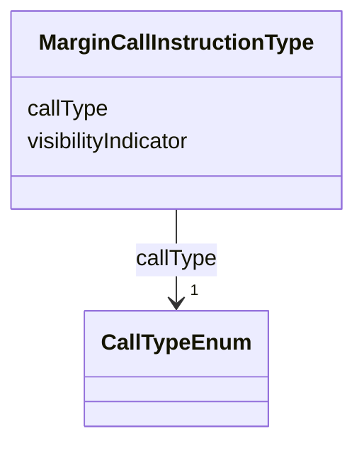

```mermaid
 classDiagram
    class MarginCallInstructionType
    click MarginCallInstructionType href "../MarginCallInstructionType"
      MarginCallInstructionType : callType
        
          
    
        
        
        MarginCallInstructionType --> "1" CallTypeEnum : callType
        click CallTypeEnum href "../CallTypeEnum"
    

        
      MarginCallInstructionType : visibilityIndicator
        
      
```
