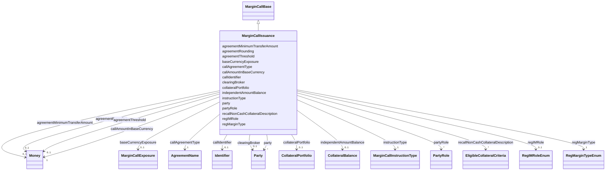

```mermaid
 classDiagram
    class MarginCallIssuance
    click MarginCallIssuance href "../MarginCallIssuance"
      MarginCallBase <|-- MarginCallIssuance
        click MarginCallBase href "../MarginCallBase"
      
      MarginCallIssuance : agreementMinimumTransferAmount
        
          
    
        
        
        MarginCallIssuance --> "0..1" Money : agreementMinimumTransferAmount
        click Money href "../Money"
    

        
      MarginCallIssuance : agreementRounding
        
          
    
        
        
        MarginCallIssuance --> "0..1" Money : agreementRounding
        click Money href "../Money"
    

        
      MarginCallIssuance : agreementThreshold
        
          
    
        
        
        MarginCallIssuance --> "0..1" Money : agreementThreshold
        click Money href "../Money"
    

        
      MarginCallIssuance : baseCurrencyExposure
        
          
    
        
        
        MarginCallIssuance --> "0..1" MarginCallExposure : baseCurrencyExposure
        click MarginCallExposure href "../MarginCallExposure"
    

        
      MarginCallIssuance : callAgreementType
        
          
    
        
        
        MarginCallIssuance --> "1" AgreementName : callAgreementType
        click AgreementName href "../AgreementName"
    

        
      MarginCallIssuance : callAmountInBaseCurrency
        
          
    
        
        
        MarginCallIssuance --> "1" Money : callAmountInBaseCurrency
        click Money href "../Money"
    

        
      MarginCallIssuance : callIdentifier
        
          
    
        
        
        MarginCallIssuance --> "0..1" Identifier : callIdentifier
        click Identifier href "../Identifier"
    

        
      MarginCallIssuance : clearingBroker
        
          
    
        
        
        MarginCallIssuance --> "0..1" Party : clearingBroker
        click Party href "../Party"
    

        
      MarginCallIssuance : collateralPortfolio
        
          
    
        
        
        MarginCallIssuance --> "0..1" CollateralPortfolio : collateralPortfolio
        click CollateralPortfolio href "../CollateralPortfolio"
    

        
      MarginCallIssuance : independentAmountBalance
        
          
    
        
        
        MarginCallIssuance --> "0..1" CollateralBalance : independentAmountBalance
        click CollateralBalance href "../CollateralBalance"
    

        
      MarginCallIssuance : instructionType
        
          
    
        
        
        MarginCallIssuance --> "1" MarginCallInstructionType : instructionType
        click MarginCallInstructionType href "../MarginCallInstructionType"
    

        
      MarginCallIssuance : party
        
          
    
        
        
        MarginCallIssuance --> "*" Party : party
        click Party href "../Party"
    

        
      MarginCallIssuance : partyRole
        
          
    
        
        
        MarginCallIssuance --> "*" PartyRole : partyRole
        click PartyRole href "../PartyRole"
    

        
      MarginCallIssuance : recallNonCashCollateralDescription
        
          
    
        
        
        MarginCallIssuance --> "*" EligibleCollateralCriteria : recallNonCashCollateralDescription
        click EligibleCollateralCriteria href "../EligibleCollateralCriteria"
    

        
      MarginCallIssuance : regIMRole
        
          
    
        
        
        MarginCallIssuance --> "0..1" RegIMRoleEnum : regIMRole
        click RegIMRoleEnum href "../RegIMRoleEnum"
    

        
      MarginCallIssuance : regMarginType
        
          
    
        
        
        MarginCallIssuance --> "1" RegMarginTypeEnum : regMarginType
        click RegMarginTypeEnum href "../RegMarginTypeEnum"
    

        
      
```
