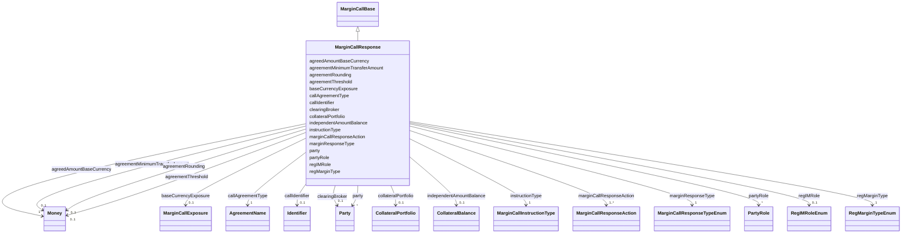

```mermaid
 classDiagram
    class MarginCallResponse
    click MarginCallResponse href "../MarginCallResponse"
      MarginCallBase <|-- MarginCallResponse
        click MarginCallBase href "../MarginCallBase"
      
      MarginCallResponse : agreedAmountBaseCurrency
        
          
    
        
        
        MarginCallResponse --> "1" Money : agreedAmountBaseCurrency
        click Money href "../Money"
    

        
      MarginCallResponse : agreementMinimumTransferAmount
        
          
    
        
        
        MarginCallResponse --> "0..1" Money : agreementMinimumTransferAmount
        click Money href "../Money"
    

        
      MarginCallResponse : agreementRounding
        
          
    
        
        
        MarginCallResponse --> "0..1" Money : agreementRounding
        click Money href "../Money"
    

        
      MarginCallResponse : agreementThreshold
        
          
    
        
        
        MarginCallResponse --> "0..1" Money : agreementThreshold
        click Money href "../Money"
    

        
      MarginCallResponse : baseCurrencyExposure
        
          
    
        
        
        MarginCallResponse --> "0..1" MarginCallExposure : baseCurrencyExposure
        click MarginCallExposure href "../MarginCallExposure"
    

        
      MarginCallResponse : callAgreementType
        
          
    
        
        
        MarginCallResponse --> "1" AgreementName : callAgreementType
        click AgreementName href "../AgreementName"
    

        
      MarginCallResponse : callIdentifier
        
          
    
        
        
        MarginCallResponse --> "0..1" Identifier : callIdentifier
        click Identifier href "../Identifier"
    

        
      MarginCallResponse : clearingBroker
        
          
    
        
        
        MarginCallResponse --> "0..1" Party : clearingBroker
        click Party href "../Party"
    

        
      MarginCallResponse : collateralPortfolio
        
          
    
        
        
        MarginCallResponse --> "0..1" CollateralPortfolio : collateralPortfolio
        click CollateralPortfolio href "../CollateralPortfolio"
    

        
      MarginCallResponse : independentAmountBalance
        
          
    
        
        
        MarginCallResponse --> "0..1" CollateralBalance : independentAmountBalance
        click CollateralBalance href "../CollateralBalance"
    

        
      MarginCallResponse : instructionType
        
          
    
        
        
        MarginCallResponse --> "1" MarginCallInstructionType : instructionType
        click MarginCallInstructionType href "../MarginCallInstructionType"
    

        
      MarginCallResponse : marginCallResponseAction
        
          
    
        
        
        MarginCallResponse --> "1..*" MarginCallResponseAction : marginCallResponseAction
        click MarginCallResponseAction href "../MarginCallResponseAction"
    

        
      MarginCallResponse : marginResponseType
        
          
    
        
        
        MarginCallResponse --> "1" MarginCallResponseTypeEnum : marginResponseType
        click MarginCallResponseTypeEnum href "../MarginCallResponseTypeEnum"
    

        
      MarginCallResponse : party
        
          
    
        
        
        MarginCallResponse --> "*" Party : party
        click Party href "../Party"
    

        
      MarginCallResponse : partyRole
        
          
    
        
        
        MarginCallResponse --> "*" PartyRole : partyRole
        click PartyRole href "../PartyRole"
    

        
      MarginCallResponse : regIMRole
        
          
    
        
        
        MarginCallResponse --> "0..1" RegIMRoleEnum : regIMRole
        click RegIMRoleEnum href "../RegIMRoleEnum"
    

        
      MarginCallResponse : regMarginType
        
          
    
        
        
        MarginCallResponse --> "1" RegMarginTypeEnum : regMarginType
        click RegMarginTypeEnum href "../RegMarginTypeEnum"
    

        
      
```
