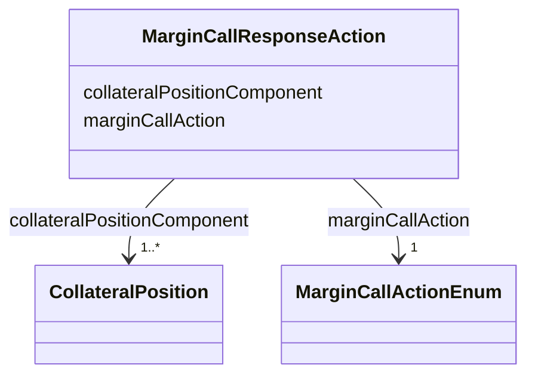

```mermaid
 classDiagram
    class MarginCallResponseAction
    click MarginCallResponseAction href "../MarginCallResponseAction"
      MarginCallResponseAction : collateralPositionComponent
        
          
    
        
        
        MarginCallResponseAction --> "1..*" CollateralPosition : collateralPositionComponent
        click CollateralPosition href "../CollateralPosition"
    

        
      MarginCallResponseAction : marginCallAction
        
          
    
        
        
        MarginCallResponseAction --> "1" MarginCallActionEnum : marginCallAction
        click MarginCallActionEnum href "../MarginCallActionEnum"
    

        
      
```
