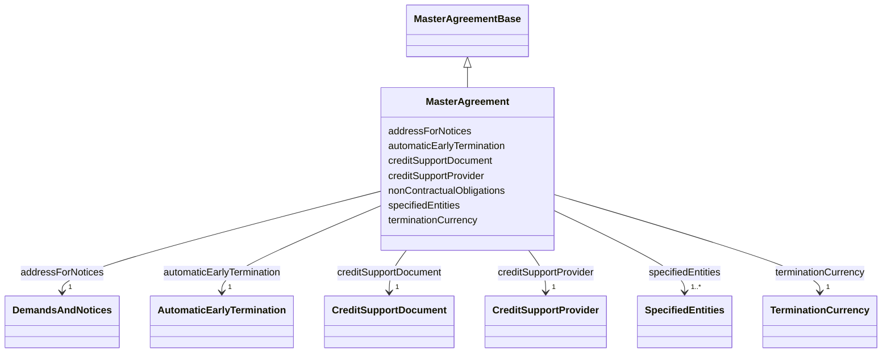

```mermaid
 classDiagram
    class MasterAgreement
    click MasterAgreement href "../MasterAgreement"
      MasterAgreementBase <|-- MasterAgreement
        click MasterAgreementBase href "../MasterAgreementBase"
      
      MasterAgreement : addressForNotices
        
          
    
        
        
        MasterAgreement --> "1" DemandsAndNotices : addressForNotices
        click DemandsAndNotices href "../DemandsAndNotices"
    

        
      MasterAgreement : automaticEarlyTermination
        
          
    
        
        
        MasterAgreement --> "1" AutomaticEarlyTermination : automaticEarlyTermination
        click AutomaticEarlyTermination href "../AutomaticEarlyTermination"
    

        
      MasterAgreement : creditSupportDocument
        
          
    
        
        
        MasterAgreement --> "1" CreditSupportDocument : creditSupportDocument
        click CreditSupportDocument href "../CreditSupportDocument"
    

        
      MasterAgreement : creditSupportProvider
        
          
    
        
        
        MasterAgreement --> "1" CreditSupportProvider : creditSupportProvider
        click CreditSupportProvider href "../CreditSupportProvider"
    

        
      MasterAgreement : nonContractualObligations
        
      MasterAgreement : specifiedEntities
        
          
    
        
        
        MasterAgreement --> "1..*" SpecifiedEntities : specifiedEntities
        click SpecifiedEntities href "../SpecifiedEntities"
    

        
      MasterAgreement : terminationCurrency
        
          
    
        
        
        MasterAgreement --> "1" TerminationCurrency : terminationCurrency
        click TerminationCurrency href "../TerminationCurrency"
    

        
      
```
