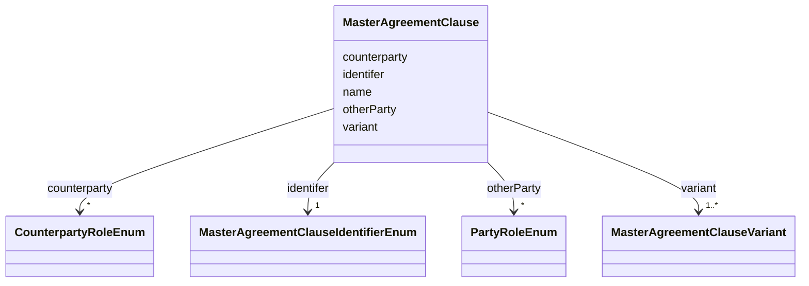

```mermaid
 classDiagram
    class MasterAgreementClause
    click MasterAgreementClause href "../MasterAgreementClause"
      MasterAgreementClause : counterparty
        
          
    
        
        
        MasterAgreementClause --> "*" CounterpartyRoleEnum : counterparty
        click CounterpartyRoleEnum href "../CounterpartyRoleEnum"
    

        
      MasterAgreementClause : identifer
        
          
    
        
        
        MasterAgreementClause --> "1" MasterAgreementClauseIdentifierEnum : identifer
        click MasterAgreementClauseIdentifierEnum href "../MasterAgreementClauseIdentifierEnum"
    

        
      MasterAgreementClause : name
        
      MasterAgreementClause : otherParty
        
          
    
        
        
        MasterAgreementClause --> "*" PartyRoleEnum : otherParty
        click PartyRoleEnum href "../PartyRoleEnum"
    

        
      MasterAgreementClause : variant
        
          
    
        
        
        MasterAgreementClause --> "1..*" MasterAgreementClauseVariant : variant
        click MasterAgreementClauseVariant href "../MasterAgreementClauseVariant"
    

        
      
```
