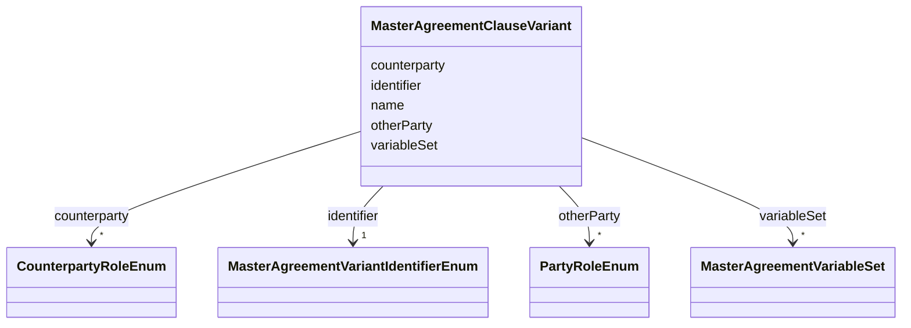

```mermaid
 classDiagram
    class MasterAgreementClauseVariant
    click MasterAgreementClauseVariant href "../MasterAgreementClauseVariant"
      MasterAgreementClauseVariant : counterparty
        
          
    
        
        
        MasterAgreementClauseVariant --> "*" CounterpartyRoleEnum : counterparty
        click CounterpartyRoleEnum href "../CounterpartyRoleEnum"
    

        
      MasterAgreementClauseVariant : identifier
        
          
    
        
        
        MasterAgreementClauseVariant --> "1" MasterAgreementVariantIdentifierEnum : identifier
        click MasterAgreementVariantIdentifierEnum href "../MasterAgreementVariantIdentifierEnum"
    

        
      MasterAgreementClauseVariant : name
        
      MasterAgreementClauseVariant : otherParty
        
          
    
        
        
        MasterAgreementClauseVariant --> "*" PartyRoleEnum : otherParty
        click PartyRoleEnum href "../PartyRoleEnum"
    

        
      MasterAgreementClauseVariant : variableSet
        
          
    
        
        
        MasterAgreementClauseVariant --> "*" MasterAgreementVariableSet : variableSet
        click MasterAgreementVariableSet href "../MasterAgreementVariableSet"
    

        
      
```
