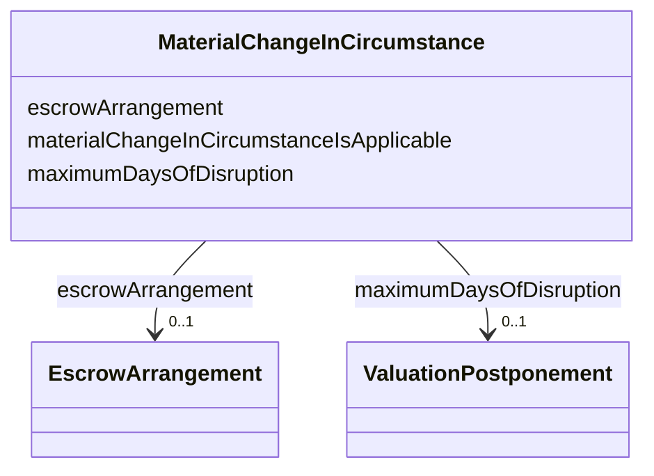

```mermaid
 classDiagram
    class MaterialChangeInCircumstance
    click MaterialChangeInCircumstance href "../MaterialChangeInCircumstance"
      MaterialChangeInCircumstance : escrowArrangement
        
          
    
        
        
        MaterialChangeInCircumstance --> "0..1" EscrowArrangement : escrowArrangement
        click EscrowArrangement href "../EscrowArrangement"
    

        
      MaterialChangeInCircumstance : materialChangeInCircumstanceIsApplicable
        
      MaterialChangeInCircumstance : maximumDaysOfDisruption
        
          
    
        
        
        MaterialChangeInCircumstance --> "0..1" ValuationPostponement : maximumDaysOfDisruption
        click ValuationPostponement href "../ValuationPostponement"
    

        
      
```
