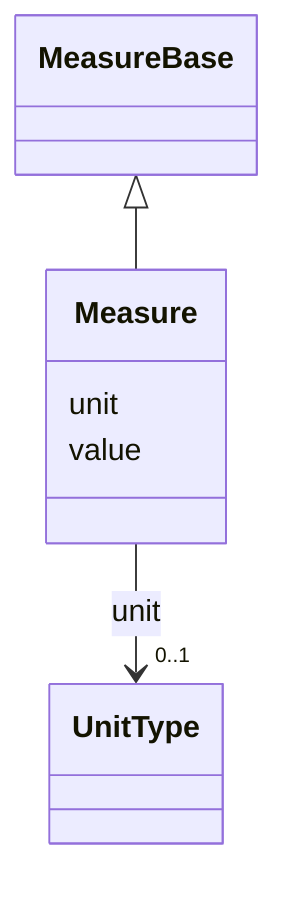

```mermaid
 classDiagram
    class Measure
    click Measure href "../Measure"
      MeasureBase <|-- Measure
        click MeasureBase href "../MeasureBase"
      
      Measure : unit
        
          
    
        
        
        Measure --> "0..1" UnitType : unit
        click UnitType href "../UnitType"
    

        
      Measure : value
        
      
```
