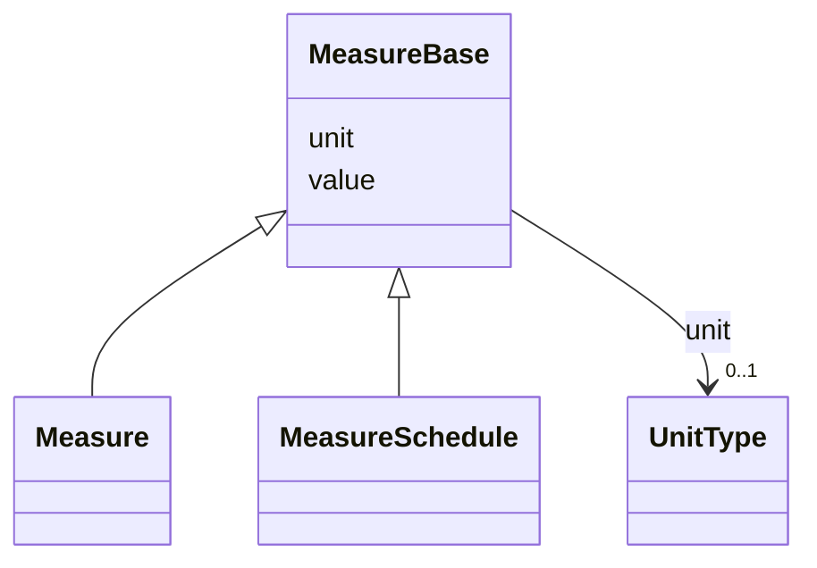

```mermaid
 classDiagram
    class MeasureBase
    click MeasureBase href "../MeasureBase"
      MeasureBase <|-- Measure
        click Measure href "../Measure"
      MeasureBase <|-- MeasureSchedule
        click MeasureSchedule href "../MeasureSchedule"
      
      MeasureBase : unit
        
          
    
        
        
        MeasureBase --> "0..1" UnitType : unit
        click UnitType href "../UnitType"
    

        
      MeasureBase : value
        
      
```
