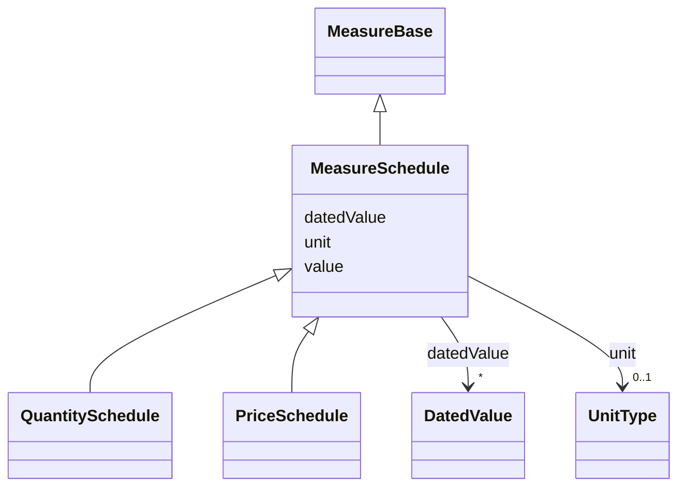

```mermaid
 classDiagram
    class MeasureSchedule
    click MeasureSchedule href "../MeasureSchedule"
      MeasureBase <|-- MeasureSchedule
        click MeasureBase href "../MeasureBase"
      

      MeasureSchedule <|-- QuantitySchedule
        click QuantitySchedule href "../QuantitySchedule"
      MeasureSchedule <|-- PriceSchedule
        click PriceSchedule href "../PriceSchedule"
      

      MeasureSchedule : datedValue
        
          
    
        
        
        MeasureSchedule --> "*" DatedValue : datedValue
        click DatedValue href "../DatedValue"
    

        
      MeasureSchedule : unit
        
          
    
        
        
        MeasureSchedule --> "0..1" UnitType : unit
        click UnitType href "../UnitType"
    

        
      MeasureSchedule : value
        
      
```
