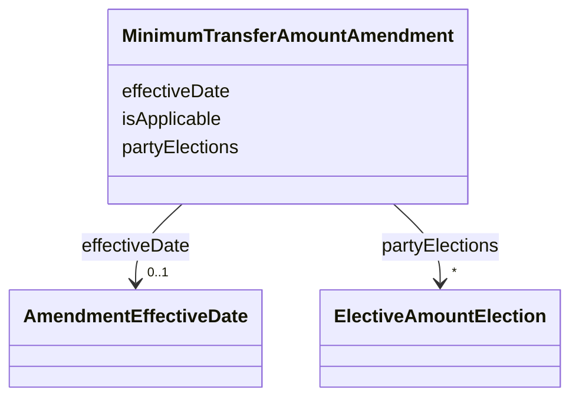

```mermaid
 classDiagram
    class MinimumTransferAmountAmendment
    click MinimumTransferAmountAmendment href "../MinimumTransferAmountAmendment"
      MinimumTransferAmountAmendment : effectiveDate
        
          
    
        
        
        MinimumTransferAmountAmendment --> "0..1" AmendmentEffectiveDate : effectiveDate
        click AmendmentEffectiveDate href "../AmendmentEffectiveDate"
    

        
      MinimumTransferAmountAmendment : isApplicable
        
      MinimumTransferAmountAmendment : partyElections
        
          
    
        
        
        MinimumTransferAmountAmendment --> "*" ElectiveAmountElection : partyElections
        click ElectiveAmountElection href "../ElectiveAmountElection"
    

        
      
```
