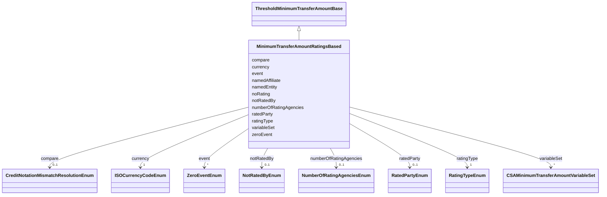

```mermaid
 classDiagram
    class MinimumTransferAmountRatingsBased
    click MinimumTransferAmountRatingsBased href "../MinimumTransferAmountRatingsBased"
      ThresholdMinimumTransferAmountBase <|-- MinimumTransferAmountRatingsBased
        click ThresholdMinimumTransferAmountBase href "../ThresholdMinimumTransferAmountBase"
      
      MinimumTransferAmountRatingsBased : compare
        
          
    
        
        
        MinimumTransferAmountRatingsBased --> "0..1" CreditNotationMismatchResolutionEnum : compare
        click CreditNotationMismatchResolutionEnum href "../CreditNotationMismatchResolutionEnum"
    

        
      MinimumTransferAmountRatingsBased : currency
        
          
    
        
        
        MinimumTransferAmountRatingsBased --> "1" ISOCurrencyCodeEnum : currency
        click ISOCurrencyCodeEnum href "../ISOCurrencyCodeEnum"
    

        
      MinimumTransferAmountRatingsBased : event
        
          
    
        
        
        MinimumTransferAmountRatingsBased --> "*" ZeroEventEnum : event
        click ZeroEventEnum href "../ZeroEventEnum"
    

        
      MinimumTransferAmountRatingsBased : namedAffiliate
        
      MinimumTransferAmountRatingsBased : namedEntity
        
      MinimumTransferAmountRatingsBased : noRating
        
      MinimumTransferAmountRatingsBased : notRatedBy
        
          
    
        
        
        MinimumTransferAmountRatingsBased --> "0..1" NotRatedByEnum : notRatedBy
        click NotRatedByEnum href "../NotRatedByEnum"
    

        
      MinimumTransferAmountRatingsBased : numberOfRatingAgencies
        
          
    
        
        
        MinimumTransferAmountRatingsBased --> "0..1" NumberOfRatingAgenciesEnum : numberOfRatingAgencies
        click NumberOfRatingAgenciesEnum href "../NumberOfRatingAgenciesEnum"
    

        
      MinimumTransferAmountRatingsBased : ratedParty
        
          
    
        
        
        MinimumTransferAmountRatingsBased --> "0..1" RatedPartyEnum : ratedParty
        click RatedPartyEnum href "../RatedPartyEnum"
    

        
      MinimumTransferAmountRatingsBased : ratingType
        
          
    
        
        
        MinimumTransferAmountRatingsBased --> "1" RatingTypeEnum : ratingType
        click RatingTypeEnum href "../RatingTypeEnum"
    

        
      MinimumTransferAmountRatingsBased : variableSet
        
          
    
        
        
        MinimumTransferAmountRatingsBased --> "*" CSAMinimumTransferAmountVariableSet : variableSet
        click CSAMinimumTransferAmountVariableSet href "../CSAMinimumTransferAmountVariableSet"
    

        
      MinimumTransferAmountRatingsBased : zeroEvent
        
      
```
