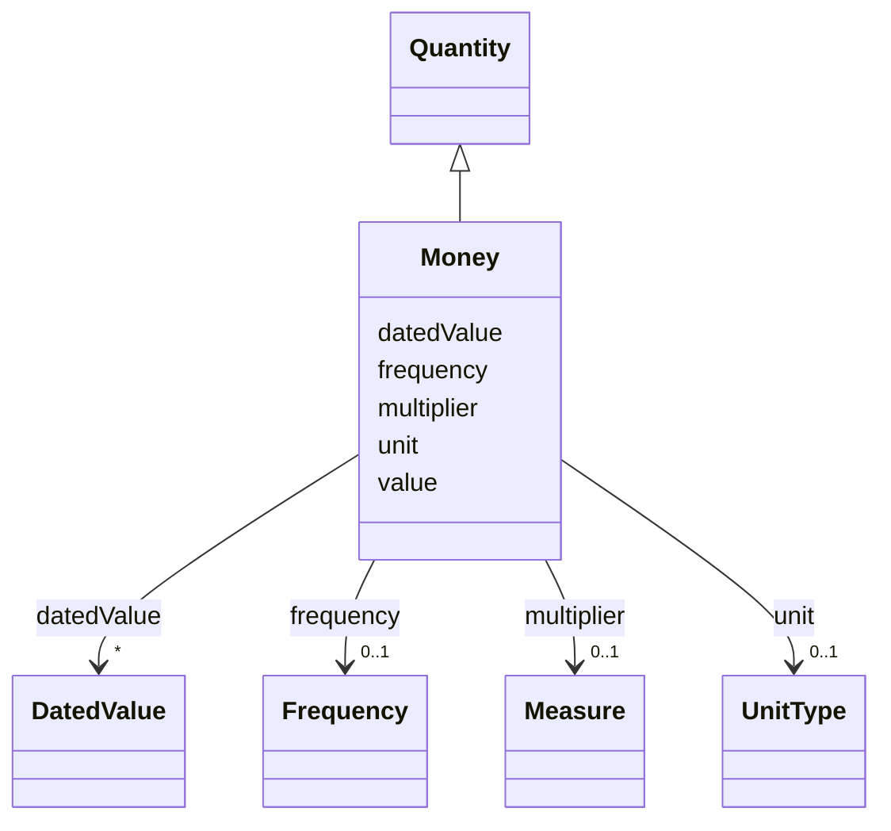

```mermaid
 classDiagram
    class Money
    click Money href "../Money"
      Quantity <|-- Money
        click Quantity href "../Quantity"
      
      Money : datedValue
        
          
    
        
        
        Money --> "*" DatedValue : datedValue
        click DatedValue href "../DatedValue"
    

        
      Money : frequency
        
          
    
        
        
        Money --> "0..1" Frequency : frequency
        click Frequency href "../Frequency"
    

        
      Money : multiplier
        
          
    
        
        
        Money --> "0..1" Measure : multiplier
        click Measure href "../Measure"
    

        
      Money : unit
        
          
    
        
        
        Money --> "0..1" UnitType : unit
        click UnitType href "../UnitType"
    

        
      Money : value
        
      
```
