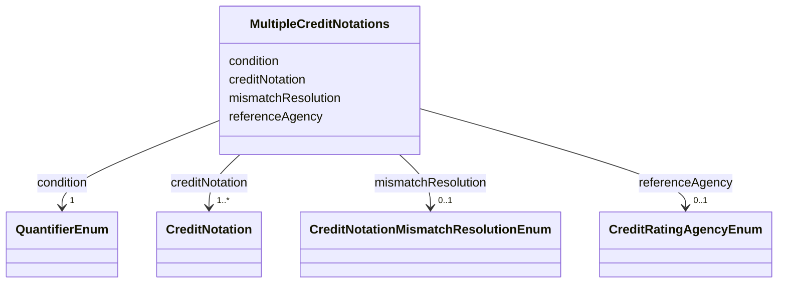

```mermaid
 classDiagram
    class MultipleCreditNotations
    click MultipleCreditNotations href "../MultipleCreditNotations"
      MultipleCreditNotations : condition
        
          
    
        
        
        MultipleCreditNotations --> "1" QuantifierEnum : condition
        click QuantifierEnum href "../QuantifierEnum"
    

        
      MultipleCreditNotations : creditNotation
        
          
    
        
        
        MultipleCreditNotations --> "1..*" CreditNotation : creditNotation
        click CreditNotation href "../CreditNotation"
    

        
      MultipleCreditNotations : mismatchResolution
        
          
    
        
        
        MultipleCreditNotations --> "0..1" CreditNotationMismatchResolutionEnum : mismatchResolution
        click CreditNotationMismatchResolutionEnum href "../CreditNotationMismatchResolutionEnum"
    

        
      MultipleCreditNotations : referenceAgency
        
          
    
        
        
        MultipleCreditNotations --> "0..1" CreditRatingAgencyEnum : referenceAgency
        click CreditRatingAgencyEnum href "../CreditRatingAgencyEnum"
    

        
      
```
