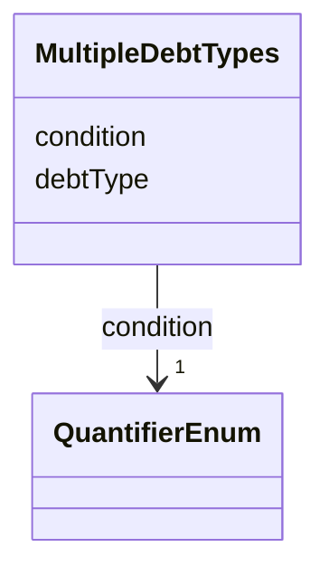

```mermaid
 classDiagram
    class MultipleDebtTypes
    click MultipleDebtTypes href "../MultipleDebtTypes"
      MultipleDebtTypes : condition
        
          
    
        
        
        MultipleDebtTypes --> "1" QuantifierEnum : condition
        click QuantifierEnum href "../QuantifierEnum"
    

        
      MultipleDebtTypes : debtType
        
      
```
