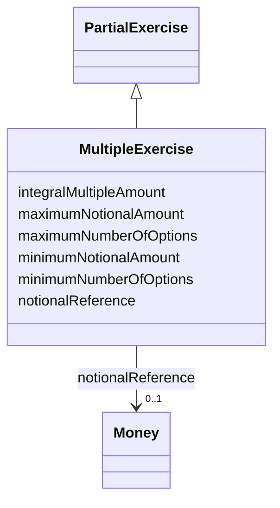

```mermaid
 classDiagram
    class MultipleExercise
    click MultipleExercise href "../MultipleExercise"
      PartialExercise <|-- MultipleExercise
        click PartialExercise href "../PartialExercise"
      
      MultipleExercise : integralMultipleAmount
        
      MultipleExercise : maximumNotionalAmount
        
      MultipleExercise : maximumNumberOfOptions
        
      MultipleExercise : minimumNotionalAmount
        
      MultipleExercise : minimumNumberOfOptions
        
      MultipleExercise : notionalReference
        
          
    
        
        
        MultipleExercise --> "0..1" Money : notionalReference
        click Money href "../Money"
    

        
      
```
