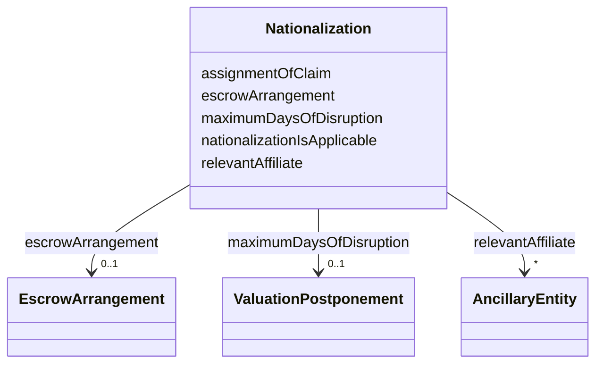

```mermaid
 classDiagram
    class Nationalization
    click Nationalization href "../Nationalization"
      Nationalization : assignmentOfClaim
        
      Nationalization : escrowArrangement
        
          
    
        
        
        Nationalization --> "0..1" EscrowArrangement : escrowArrangement
        click EscrowArrangement href "../EscrowArrangement"
    

        
      Nationalization : maximumDaysOfDisruption
        
          
    
        
        
        Nationalization --> "0..1" ValuationPostponement : maximumDaysOfDisruption
        click ValuationPostponement href "../ValuationPostponement"
    

        
      Nationalization : nationalizationIsApplicable
        
      Nationalization : relevantAffiliate
        
          
    
        
        
        Nationalization --> "*" AncillaryEntity : relevantAffiliate
        click AncillaryEntity href "../AncillaryEntity"
    

        
      
```
