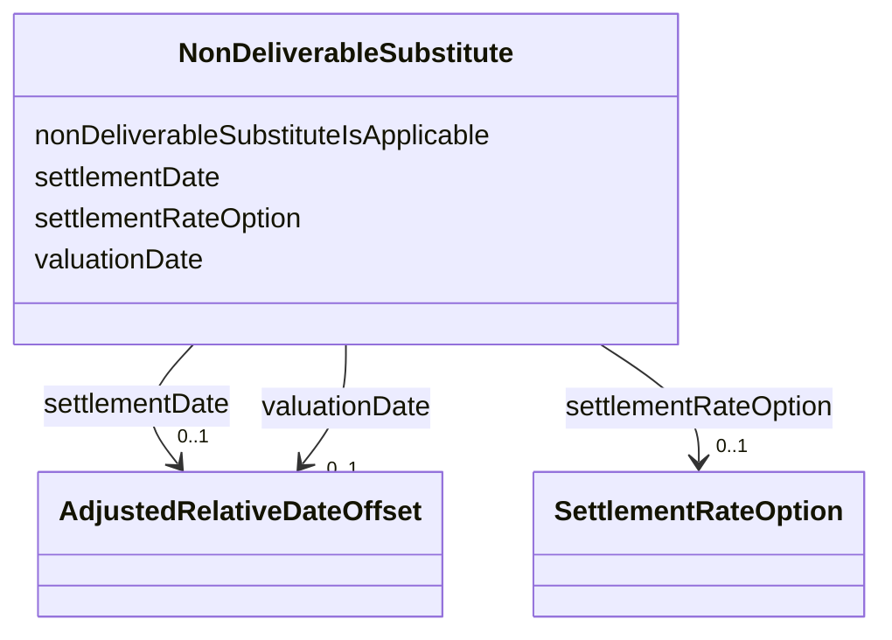

```mermaid
 classDiagram
    class NonDeliverableSubstitute
    click NonDeliverableSubstitute href "../NonDeliverableSubstitute"
      NonDeliverableSubstitute : nonDeliverableSubstituteIsApplicable
        
      NonDeliverableSubstitute : settlementDate
        
          
    
        
        
        NonDeliverableSubstitute --> "0..1" AdjustedRelativeDateOffset : settlementDate
        click AdjustedRelativeDateOffset href "../AdjustedRelativeDateOffset"
    

        
      NonDeliverableSubstitute : settlementRateOption
        
          
    
        
        
        NonDeliverableSubstitute --> "0..1" SettlementRateOption : settlementRateOption
        click SettlementRateOption href "../SettlementRateOption"
    

        
      NonDeliverableSubstitute : valuationDate
        
          
    
        
        
        NonDeliverableSubstitute --> "0..1" AdjustedRelativeDateOffset : valuationDate
        click AdjustedRelativeDateOffset href "../AdjustedRelativeDateOffset"
    

        
      
```
