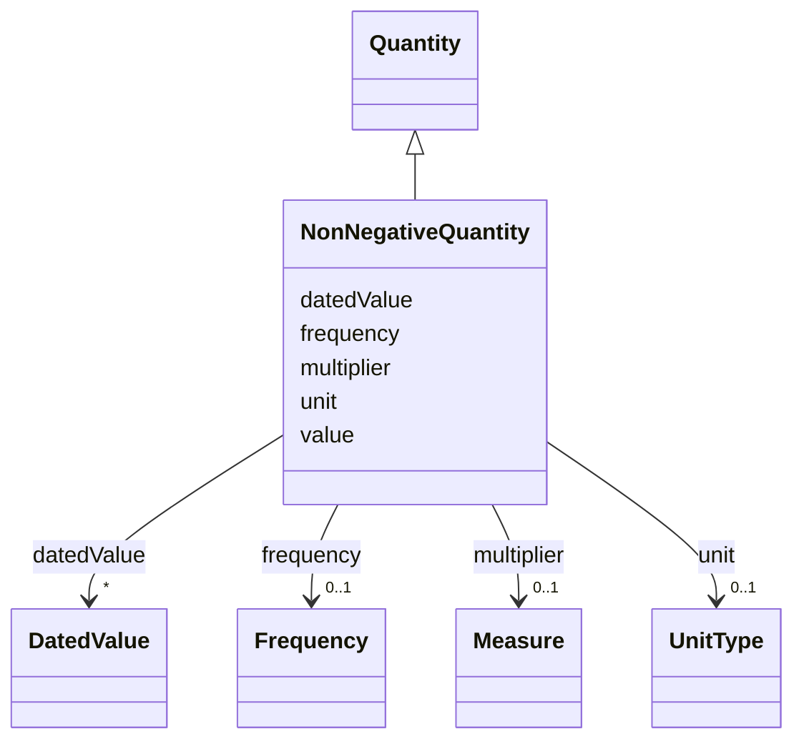

```mermaid
 classDiagram
    class NonNegativeQuantity
    click NonNegativeQuantity href "../NonNegativeQuantity"
      Quantity <|-- NonNegativeQuantity
        click Quantity href "../Quantity"
      
      NonNegativeQuantity : datedValue
        
          
    
        
        
        NonNegativeQuantity --> "*" DatedValue : datedValue
        click DatedValue href "../DatedValue"
    

        
      NonNegativeQuantity : frequency
        
          
    
        
        
        NonNegativeQuantity --> "0..1" Frequency : frequency
        click Frequency href "../Frequency"
    

        
      NonNegativeQuantity : multiplier
        
          
    
        
        
        NonNegativeQuantity --> "0..1" Measure : multiplier
        click Measure href "../Measure"
    

        
      NonNegativeQuantity : unit
        
          
    
        
        
        NonNegativeQuantity --> "0..1" UnitType : unit
        click UnitType href "../UnitType"
    

        
      NonNegativeQuantity : value
        
      
```
