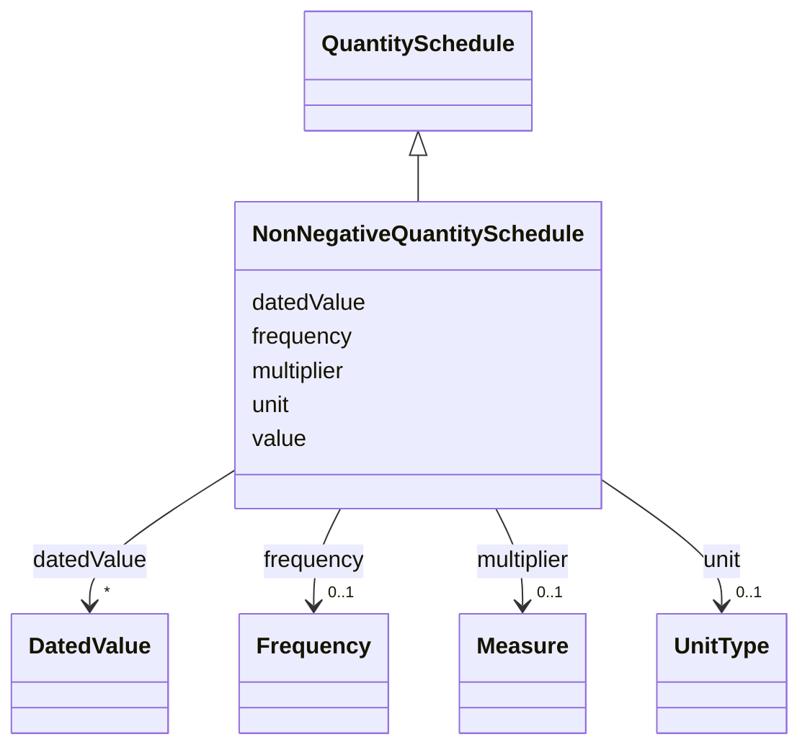

```mermaid
 classDiagram
    class NonNegativeQuantitySchedule
    click NonNegativeQuantitySchedule href "../NonNegativeQuantitySchedule"
      QuantitySchedule <|-- NonNegativeQuantitySchedule
        click QuantitySchedule href "../QuantitySchedule"
      
      NonNegativeQuantitySchedule : datedValue
        
          
    
        
        
        NonNegativeQuantitySchedule --> "*" DatedValue : datedValue
        click DatedValue href "../DatedValue"
    

        
      NonNegativeQuantitySchedule : frequency
        
          
    
        
        
        NonNegativeQuantitySchedule --> "0..1" Frequency : frequency
        click Frequency href "../Frequency"
    

        
      NonNegativeQuantitySchedule : multiplier
        
          
    
        
        
        NonNegativeQuantitySchedule --> "0..1" Measure : multiplier
        click Measure href "../Measure"
    

        
      NonNegativeQuantitySchedule : unit
        
          
    
        
        
        NonNegativeQuantitySchedule --> "0..1" UnitType : unit
        click UnitType href "../UnitType"
    

        
      NonNegativeQuantitySchedule : value
        
      
```
