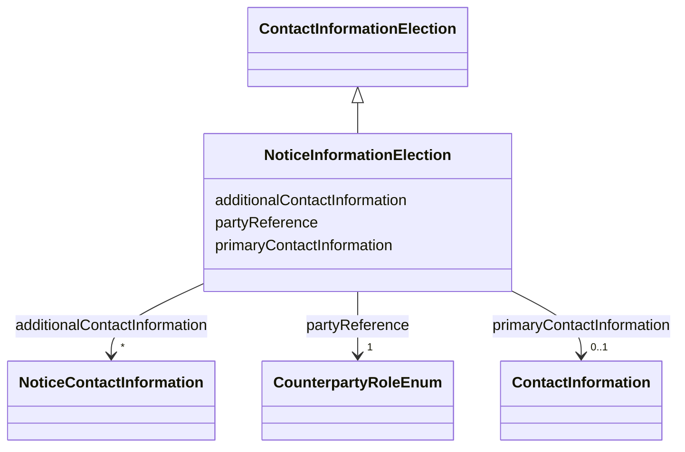

```mermaid
 classDiagram
    class NoticeInformationElection
    click NoticeInformationElection href "../NoticeInformationElection"
      ContactInformationElection <|-- NoticeInformationElection
        click ContactInformationElection href "../ContactInformationElection"
      
      NoticeInformationElection : additionalContactInformation
        
          
    
        
        
        NoticeInformationElection --> "*" NoticeContactInformation : additionalContactInformation
        click NoticeContactInformation href "../NoticeContactInformation"
    

        
      NoticeInformationElection : partyReference
        
          
    
        
        
        NoticeInformationElection --> "1" CounterpartyRoleEnum : partyReference
        click CounterpartyRoleEnum href "../CounterpartyRoleEnum"
    

        
      NoticeInformationElection : primaryContactInformation
        
          
    
        
        
        NoticeInformationElection --> "0..1" ContactInformation : primaryContactInformation
        click ContactInformation href "../ContactInformation"
    

        
      
```
