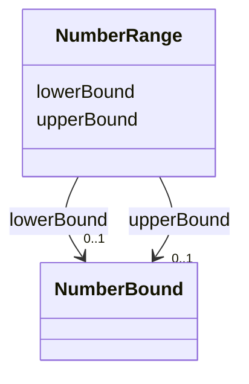

```mermaid
 classDiagram
    class NumberRange
    click NumberRange href "../NumberRange"
      NumberRange : lowerBound
        
          
    
        
        
        NumberRange --> "0..1" NumberBound : lowerBound
        click NumberBound href "../NumberBound"
    

        
      NumberRange : upperBound
        
          
    
        
        
        NumberRange --> "0..1" NumberBound : upperBound
        click NumberBound href "../NumberBound"
    

        
      
```
