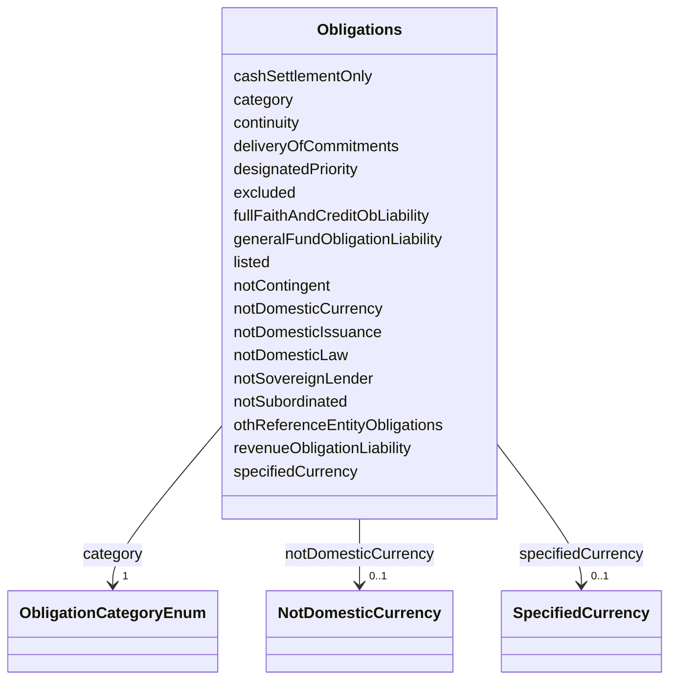

```mermaid
 classDiagram
    class Obligations
    click Obligations href "../Obligations"
      Obligations : cashSettlementOnly
        
      Obligations : category
        
          
    
        
        
        Obligations --> "1" ObligationCategoryEnum : category
        click ObligationCategoryEnum href "../ObligationCategoryEnum"
    

        
      Obligations : continuity
        
      Obligations : deliveryOfCommitments
        
      Obligations : designatedPriority
        
      Obligations : excluded
        
      Obligations : fullFaithAndCreditObLiability
        
      Obligations : generalFundObligationLiability
        
      Obligations : listed
        
      Obligations : notContingent
        
      Obligations : notDomesticCurrency
        
          
    
        
        
        Obligations --> "0..1" NotDomesticCurrency : notDomesticCurrency
        click NotDomesticCurrency href "../NotDomesticCurrency"
    

        
      Obligations : notDomesticIssuance
        
      Obligations : notDomesticLaw
        
      Obligations : notSovereignLender
        
      Obligations : notSubordinated
        
      Obligations : othReferenceEntityObligations
        
      Obligations : revenueObligationLiability
        
      Obligations : specifiedCurrency
        
          
    
        
        
        Obligations --> "0..1" SpecifiedCurrency : specifiedCurrency
        click SpecifiedCurrency href "../SpecifiedCurrency"
    

        
      
```
