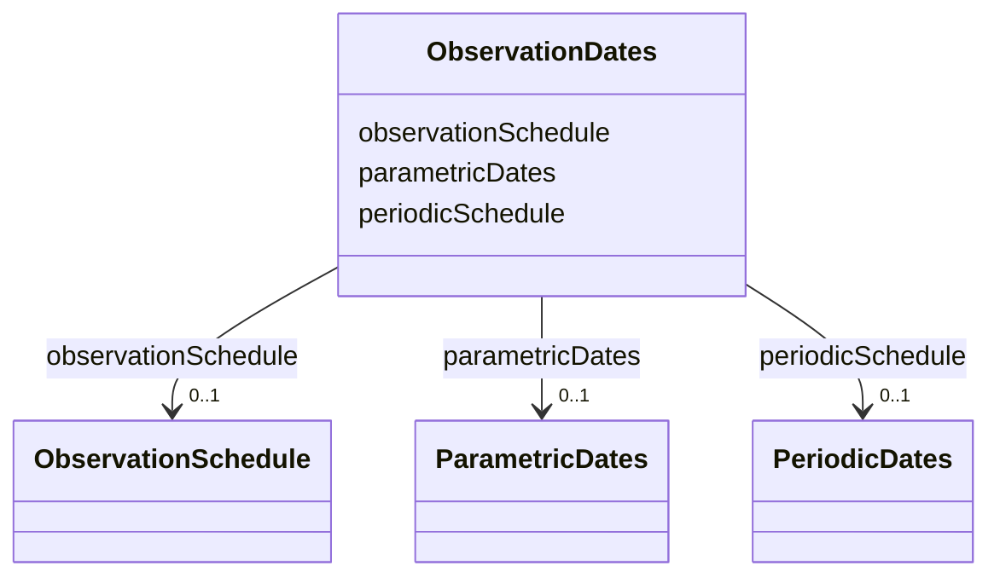

```mermaid
 classDiagram
    class ObservationDates
    click ObservationDates href "../ObservationDates"
      ObservationDates : observationSchedule
        
          
    
        
        
        ObservationDates --> "0..1" ObservationSchedule : observationSchedule
        click ObservationSchedule href "../ObservationSchedule"
    

        
      ObservationDates : parametricDates
        
          
    
        
        
        ObservationDates --> "0..1" ParametricDates : parametricDates
        click ParametricDates href "../ParametricDates"
    

        
      ObservationDates : periodicSchedule
        
          
    
        
        
        ObservationDates --> "0..1" PeriodicDates : periodicSchedule
        click PeriodicDates href "../PeriodicDates"
    

        
      
```
