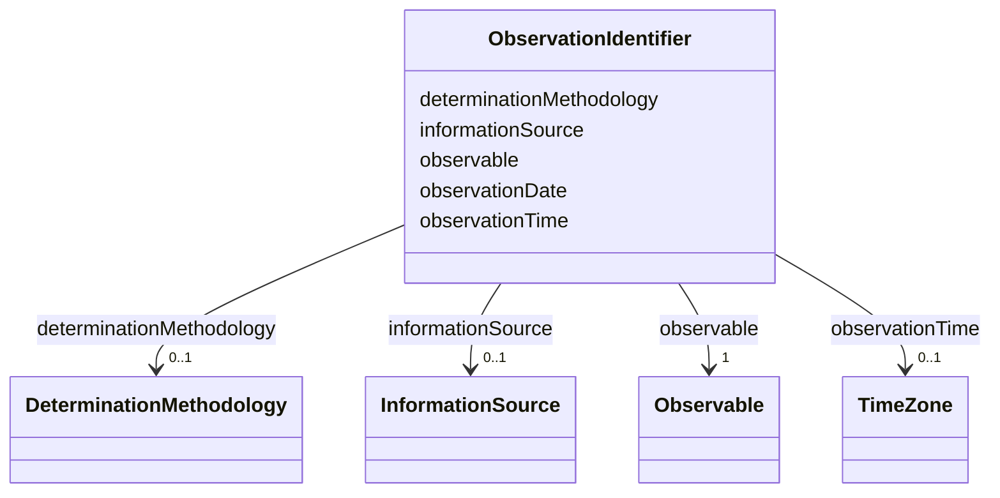

```mermaid
 classDiagram
    class ObservationIdentifier
    click ObservationIdentifier href "../ObservationIdentifier"
      ObservationIdentifier : determinationMethodology
        
          
    
        
        
        ObservationIdentifier --> "0..1" DeterminationMethodology : determinationMethodology
        click DeterminationMethodology href "../DeterminationMethodology"
    

        
      ObservationIdentifier : informationSource
        
          
    
        
        
        ObservationIdentifier --> "0..1" InformationSource : informationSource
        click InformationSource href "../InformationSource"
    

        
      ObservationIdentifier : observable
        
          
    
        
        
        ObservationIdentifier --> "1" Observable : observable
        click Observable href "../Observable"
    

        
      ObservationIdentifier : observationDate
        
      ObservationIdentifier : observationTime
        
          
    
        
        
        ObservationIdentifier --> "0..1" TimeZone : observationTime
        click TimeZone href "../TimeZone"
    

        
      
```
