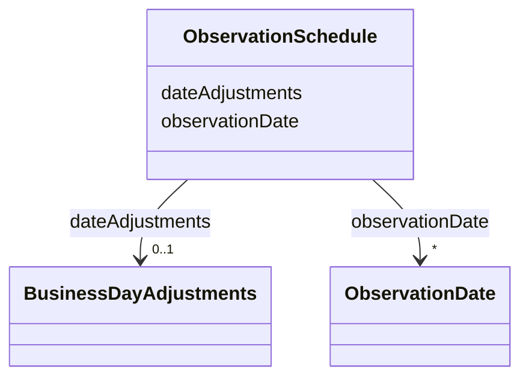

```mermaid
 classDiagram
    class ObservationSchedule
    click ObservationSchedule href "../ObservationSchedule"
      ObservationSchedule : dateAdjustments
        
          
    
        
        
        ObservationSchedule --> "0..1" BusinessDayAdjustments : dateAdjustments
        click BusinessDayAdjustments href "../BusinessDayAdjustments"
    

        
      ObservationSchedule : observationDate
        
          
    
        
        
        ObservationSchedule --> "*" ObservationDate : observationDate
        click ObservationDate href "../ObservationDate"
    

        
      
```
