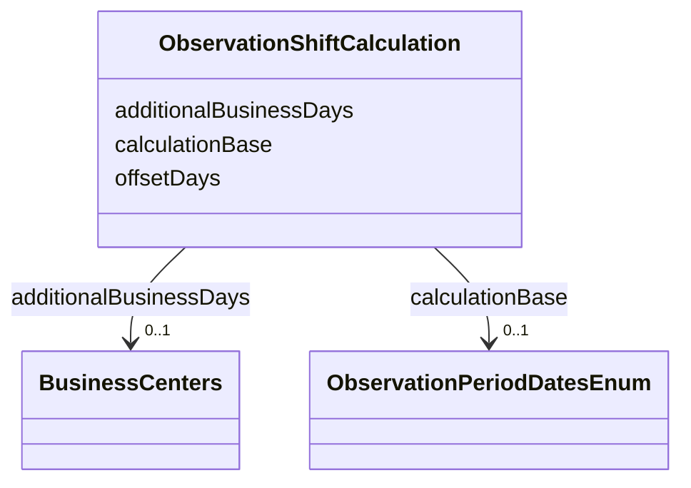

```mermaid
 classDiagram
    class ObservationShiftCalculation
    click ObservationShiftCalculation href "../ObservationShiftCalculation"
      ObservationShiftCalculation : additionalBusinessDays
        
          
    
        
        
        ObservationShiftCalculation --> "0..1" BusinessCenters : additionalBusinessDays
        click BusinessCenters href "../BusinessCenters"
    

        
      ObservationShiftCalculation : calculationBase
        
          
    
        
        
        ObservationShiftCalculation --> "0..1" ObservationPeriodDatesEnum : calculationBase
        click ObservationPeriodDatesEnum href "../ObservationPeriodDatesEnum"
    

        
      ObservationShiftCalculation : offsetDays
        
      
```
