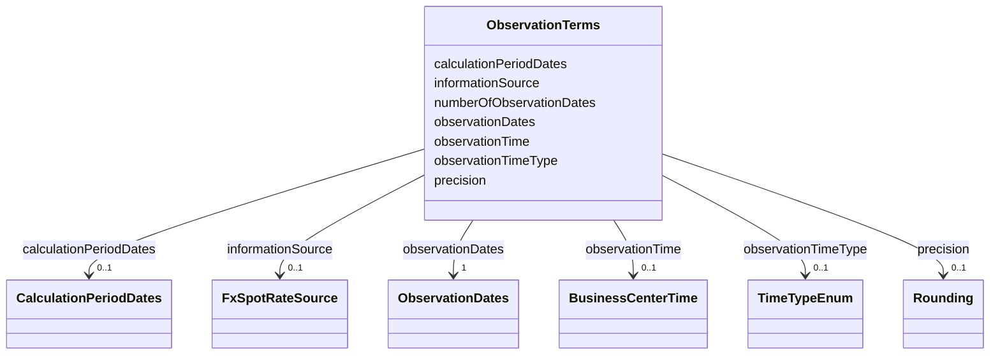

```mermaid
 classDiagram
    class ObservationTerms
    click ObservationTerms href "../ObservationTerms"
      ObservationTerms : calculationPeriodDates
        
          
    
        
        
        ObservationTerms --> "0..1" CalculationPeriodDates : calculationPeriodDates
        click CalculationPeriodDates href "../CalculationPeriodDates"
    

        
      ObservationTerms : informationSource
        
          
    
        
        
        ObservationTerms --> "0..1" FxSpotRateSource : informationSource
        click FxSpotRateSource href "../FxSpotRateSource"
    

        
      ObservationTerms : numberOfObservationDates
        
      ObservationTerms : observationDates
        
          
    
        
        
        ObservationTerms --> "1" ObservationDates : observationDates
        click ObservationDates href "../ObservationDates"
    

        
      ObservationTerms : observationTime
        
          
    
        
        
        ObservationTerms --> "0..1" BusinessCenterTime : observationTime
        click BusinessCenterTime href "../BusinessCenterTime"
    

        
      ObservationTerms : observationTimeType
        
          
    
        
        
        ObservationTerms --> "0..1" TimeTypeEnum : observationTimeType
        click TimeTypeEnum href "../TimeTypeEnum"
    

        
      ObservationTerms : precision
        
          
    
        
        
        ObservationTerms --> "0..1" Rounding : precision
        click Rounding href "../Rounding"
    

        
      
```
