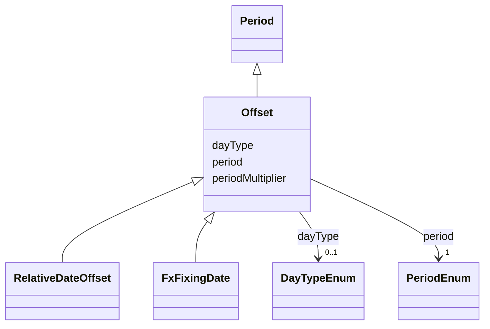

```mermaid
 classDiagram
    class Offset
    click Offset href "../Offset"
      Period <|-- Offset
        click Period href "../Period"
      

      Offset <|-- RelativeDateOffset
        click RelativeDateOffset href "../RelativeDateOffset"
      Offset <|-- FxFixingDate
        click FxFixingDate href "../FxFixingDate"
      

      Offset : dayType
        
          
    
        
        
        Offset --> "0..1" DayTypeEnum : dayType
        click DayTypeEnum href "../DayTypeEnum"
    

        
      Offset : period
        
          
    
        
        
        Offset --> "1" PeriodEnum : period
        click PeriodEnum href "../PeriodEnum"
    

        
      Offset : periodMultiplier
        
      
```
