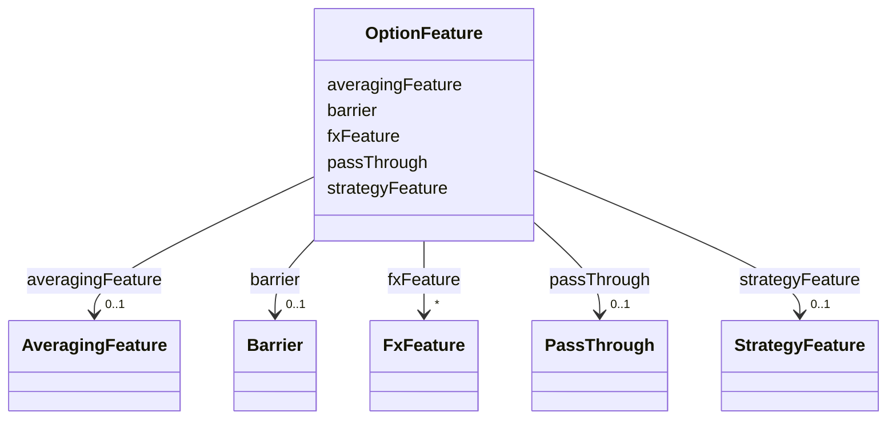

```mermaid
 classDiagram
    class OptionFeature
    click OptionFeature href "../OptionFeature"
      OptionFeature : averagingFeature
        
          
    
        
        
        OptionFeature --> "0..1" AveragingFeature : averagingFeature
        click AveragingFeature href "../AveragingFeature"
    

        
      OptionFeature : barrier
        
          
    
        
        
        OptionFeature --> "0..1" Barrier : barrier
        click Barrier href "../Barrier"
    

        
      OptionFeature : fxFeature
        
          
    
        
        
        OptionFeature --> "*" FxFeature : fxFeature
        click FxFeature href "../FxFeature"
    

        
      OptionFeature : passThrough
        
          
    
        
        
        OptionFeature --> "0..1" PassThrough : passThrough
        click PassThrough href "../PassThrough"
    

        
      OptionFeature : strategyFeature
        
          
    
        
        
        OptionFeature --> "0..1" StrategyFeature : strategyFeature
        click StrategyFeature href "../StrategyFeature"
    

        
      
```
