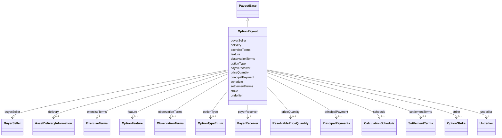

```mermaid
 classDiagram
    class OptionPayout
    click OptionPayout href "../OptionPayout"
      PayoutBase <|-- OptionPayout
        click PayoutBase href "../PayoutBase"
      
      OptionPayout : buyerSeller
        
          
    
        
        
        OptionPayout --> "1" BuyerSeller : buyerSeller
        click BuyerSeller href "../BuyerSeller"
    

        
      OptionPayout : delivery
        
          
    
        
        
        OptionPayout --> "0..1" AssetDeliveryInformation : delivery
        click AssetDeliveryInformation href "../AssetDeliveryInformation"
    

        
      OptionPayout : exerciseTerms
        
          
    
        
        
        OptionPayout --> "1" ExerciseTerms : exerciseTerms
        click ExerciseTerms href "../ExerciseTerms"
    

        
      OptionPayout : feature
        
          
    
        
        
        OptionPayout --> "0..1" OptionFeature : feature
        click OptionFeature href "../OptionFeature"
    

        
      OptionPayout : observationTerms
        
          
    
        
        
        OptionPayout --> "0..1" ObservationTerms : observationTerms
        click ObservationTerms href "../ObservationTerms"
    

        
      OptionPayout : optionType
        
          
    
        
        
        OptionPayout --> "0..1" OptionTypeEnum : optionType
        click OptionTypeEnum href "../OptionTypeEnum"
    

        
      OptionPayout : payerReceiver
        
          
    
        
        
        OptionPayout --> "1" PayerReceiver : payerReceiver
        click PayerReceiver href "../PayerReceiver"
    

        
      OptionPayout : priceQuantity
        
          
    
        
        
        OptionPayout --> "0..1" ResolvablePriceQuantity : priceQuantity
        click ResolvablePriceQuantity href "../ResolvablePriceQuantity"
    

        
      OptionPayout : principalPayment
        
          
    
        
        
        OptionPayout --> "0..1" PrincipalPayments : principalPayment
        click PrincipalPayments href "../PrincipalPayments"
    

        
      OptionPayout : schedule
        
          
    
        
        
        OptionPayout --> "0..1" CalculationSchedule : schedule
        click CalculationSchedule href "../CalculationSchedule"
    

        
      OptionPayout : settlementTerms
        
          
    
        
        
        OptionPayout --> "0..1" SettlementTerms : settlementTerms
        click SettlementTerms href "../SettlementTerms"
    

        
      OptionPayout : strike
        
          
    
        
        
        OptionPayout --> "0..1" OptionStrike : strike
        click OptionStrike href "../OptionStrike"
    

        
      OptionPayout : underlier
        
          
    
        
        
        OptionPayout --> "1" Underlier : underlier
        click Underlier href "../Underlier"
    

        
      
```
