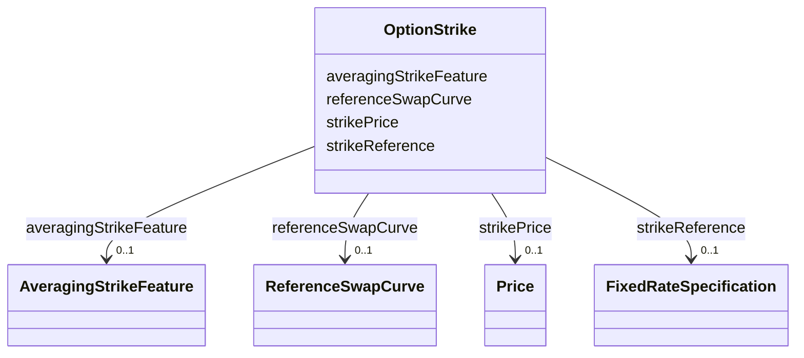

```mermaid
 classDiagram
    class OptionStrike
    click OptionStrike href "../OptionStrike"
      OptionStrike : averagingStrikeFeature
        
          
    
        
        
        OptionStrike --> "0..1" AveragingStrikeFeature : averagingStrikeFeature
        click AveragingStrikeFeature href "../AveragingStrikeFeature"
    

        
      OptionStrike : referenceSwapCurve
        
          
    
        
        
        OptionStrike --> "0..1" ReferenceSwapCurve : referenceSwapCurve
        click ReferenceSwapCurve href "../ReferenceSwapCurve"
    

        
      OptionStrike : strikePrice
        
          
    
        
        
        OptionStrike --> "0..1" Price : strikePrice
        click Price href "../Price"
    

        
      OptionStrike : strikeReference
        
          
    
        
        
        OptionStrike --> "0..1" FixedRateSpecification : strikeReference
        click FixedRateSpecification href "../FixedRateSpecification"
    

        
      
```
