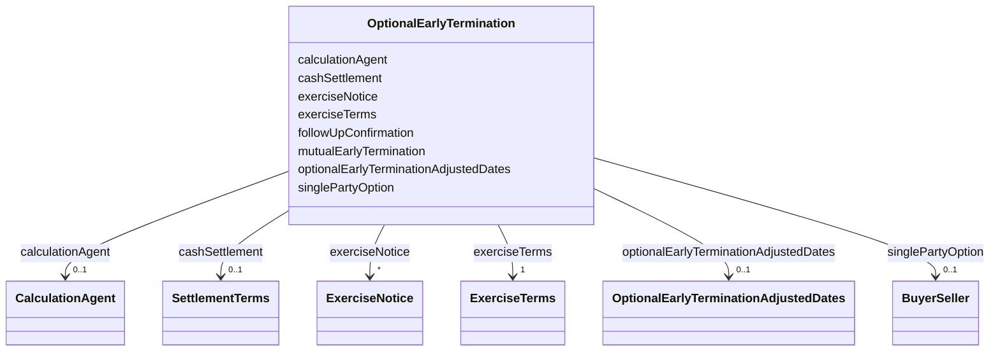

```mermaid
 classDiagram
    class OptionalEarlyTermination
    click OptionalEarlyTermination href "../OptionalEarlyTermination"
      OptionalEarlyTermination : calculationAgent
        
          
    
        
        
        OptionalEarlyTermination --> "0..1" CalculationAgent : calculationAgent
        click CalculationAgent href "../CalculationAgent"
    

        
      OptionalEarlyTermination : cashSettlement
        
          
    
        
        
        OptionalEarlyTermination --> "0..1" SettlementTerms : cashSettlement
        click SettlementTerms href "../SettlementTerms"
    

        
      OptionalEarlyTermination : exerciseNotice
        
          
    
        
        
        OptionalEarlyTermination --> "*" ExerciseNotice : exerciseNotice
        click ExerciseNotice href "../ExerciseNotice"
    

        
      OptionalEarlyTermination : exerciseTerms
        
          
    
        
        
        OptionalEarlyTermination --> "1" ExerciseTerms : exerciseTerms
        click ExerciseTerms href "../ExerciseTerms"
    

        
      OptionalEarlyTermination : followUpConfirmation
        
      OptionalEarlyTermination : mutualEarlyTermination
        
      OptionalEarlyTermination : optionalEarlyTerminationAdjustedDates
        
          
    
        
        
        OptionalEarlyTermination --> "0..1" OptionalEarlyTerminationAdjustedDates : optionalEarlyTerminationAdjustedDates
        click OptionalEarlyTerminationAdjustedDates href "../OptionalEarlyTerminationAdjustedDates"
    

        
      OptionalEarlyTermination : singlePartyOption
        
          
    
        
        
        OptionalEarlyTermination --> "0..1" BuyerSeller : singlePartyOption
        click BuyerSeller href "../BuyerSeller"
    

        
      
```
