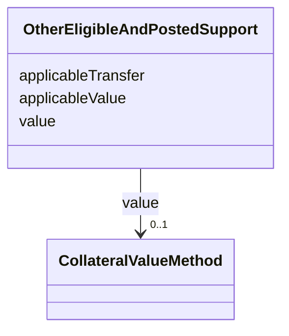

```mermaid
 classDiagram
    class OtherEligibleAndPostedSupport
    click OtherEligibleAndPostedSupport href "../OtherEligibleAndPostedSupport"
      OtherEligibleAndPostedSupport : applicableTransfer
        
      OtherEligibleAndPostedSupport : applicableValue
        
      OtherEligibleAndPostedSupport : value
        
          
    
        
        
        OtherEligibleAndPostedSupport --> "0..1" CollateralValueMethod : value
        click CollateralValueMethod href "../CollateralValueMethod"
    

        
      
```
