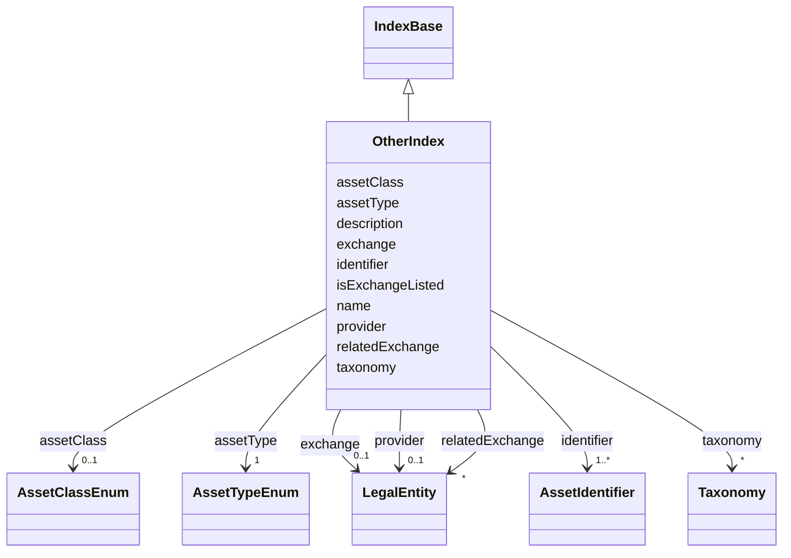

```mermaid
 classDiagram
    class OtherIndex
    click OtherIndex href "../OtherIndex"
      IndexBase <|-- OtherIndex
        click IndexBase href "../IndexBase"
      
      OtherIndex : assetClass
        
          
    
        
        
        OtherIndex --> "0..1" AssetClassEnum : assetClass
        click AssetClassEnum href "../AssetClassEnum"
    

        
      OtherIndex : assetType
        
          
    
        
        
        OtherIndex --> "1" AssetTypeEnum : assetType
        click AssetTypeEnum href "../AssetTypeEnum"
    

        
      OtherIndex : description
        
      OtherIndex : exchange
        
          
    
        
        
        OtherIndex --> "0..1" LegalEntity : exchange
        click LegalEntity href "../LegalEntity"
    

        
      OtherIndex : identifier
        
          
    
        
        
        OtherIndex --> "1..*" AssetIdentifier : identifier
        click AssetIdentifier href "../AssetIdentifier"
    

        
      OtherIndex : isExchangeListed
        
      OtherIndex : name
        
      OtherIndex : provider
        
          
    
        
        
        OtherIndex --> "0..1" LegalEntity : provider
        click LegalEntity href "../LegalEntity"
    

        
      OtherIndex : relatedExchange
        
          
    
        
        
        OtherIndex --> "*" LegalEntity : relatedExchange
        click LegalEntity href "../LegalEntity"
    

        
      OtherIndex : taxonomy
        
          
    
        
        
        OtherIndex --> "*" Taxonomy : taxonomy
        click Taxonomy href "../Taxonomy"
    

        
      
```
