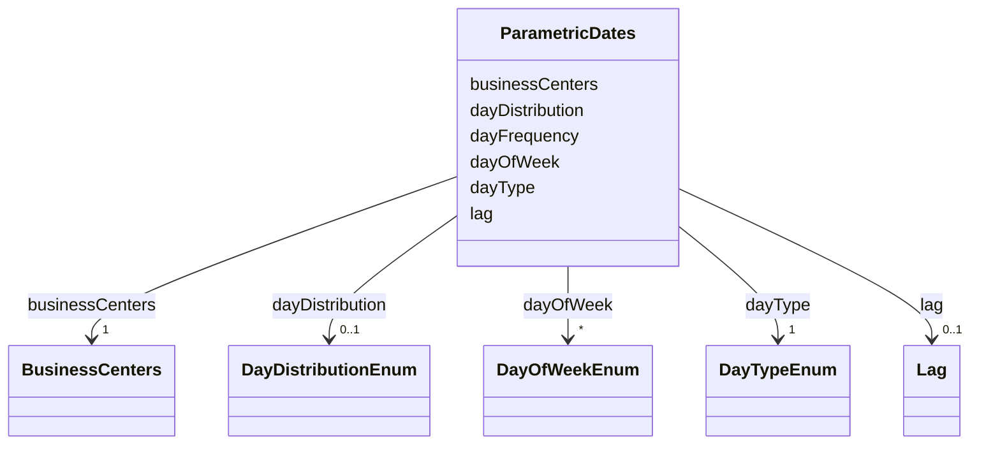

```mermaid
 classDiagram
    class ParametricDates
    click ParametricDates href "../ParametricDates"
      ParametricDates : businessCenters
        
          
    
        
        
        ParametricDates --> "1" BusinessCenters : businessCenters
        click BusinessCenters href "../BusinessCenters"
    

        
      ParametricDates : dayDistribution
        
          
    
        
        
        ParametricDates --> "0..1" DayDistributionEnum : dayDistribution
        click DayDistributionEnum href "../DayDistributionEnum"
    

        
      ParametricDates : dayFrequency
        
      ParametricDates : dayOfWeek
        
          
    
        
        
        ParametricDates --> "*" DayOfWeekEnum : dayOfWeek
        click DayOfWeekEnum href "../DayOfWeekEnum"
    

        
      ParametricDates : dayType
        
          
    
        
        
        ParametricDates --> "1" DayTypeEnum : dayType
        click DayTypeEnum href "../DayTypeEnum"
    

        
      ParametricDates : lag
        
          
    
        
        
        ParametricDates --> "0..1" Lag : lag
        click Lag href "../Lag"
    

        
      
```
